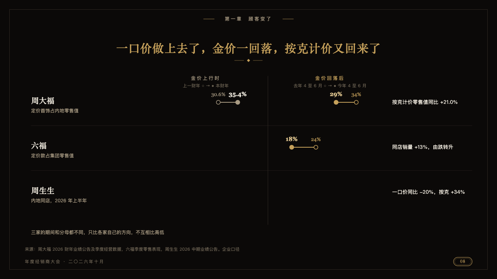
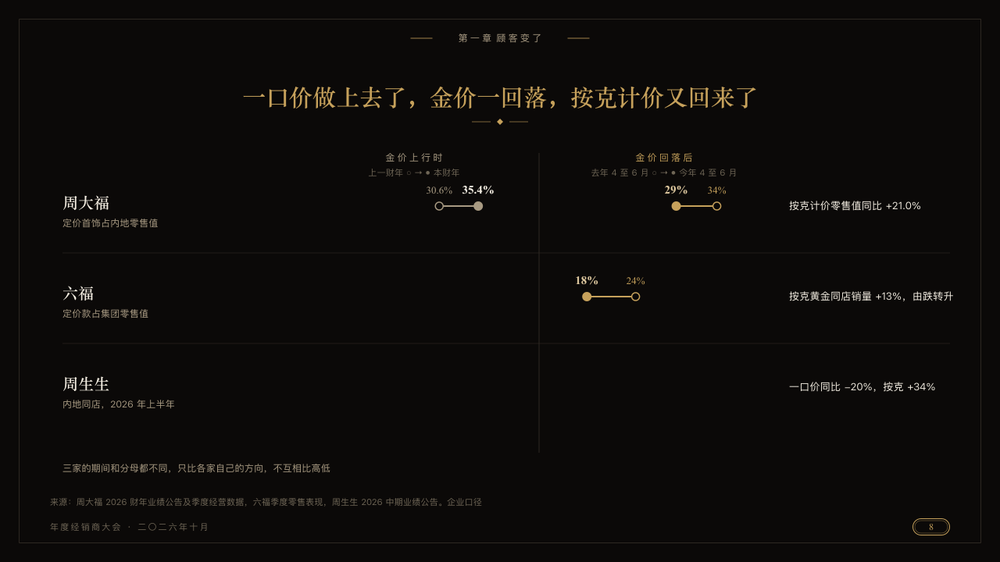

# swing

How each of a few houses moved in one stretch and then in the next, as dumbbells in two columns.

Code: [`src/layouts/compositions/swing.tsx`](../../../src/layouts/compositions/swing.tsx). The header comment there is the contract. The invitation setting only.

## luxe, gold dealer conference sample, 2026-10

Settled on p08. The round's decisions are in [2026-10-08-luxe](../../rounds/2026-10-08-luxe/README.md).

| board (p08) | engine |
| :-: | :-: |
|  |  |

**What it looks like.** Each house is a row: its name in the ivory serif, what its figures measure under it in old gold, one line on what moved at the right. Two columns of dumbbells, one for each stretch, each named small and tracked (the chart's `title`, the second in gold) and keyed by its two series, a hollow dot where the house stood and a solid one where it came to, old gold in the first stretch and gold in the second, both on one scale. A house a stretch has no figures for leaves that column empty.

**Why.** Three companies on different bases can only be compared by direction. A dot moving one way and then back says so without ranking them.

**What it gave up.**

- Takes a `row_cards` of two or three houses, then two titled `dumbbell` charts over some of the houses by name, then optionally a `paragraph`.
- A chart category that names no house, or two figures too close to stand apart, sends the page back.
