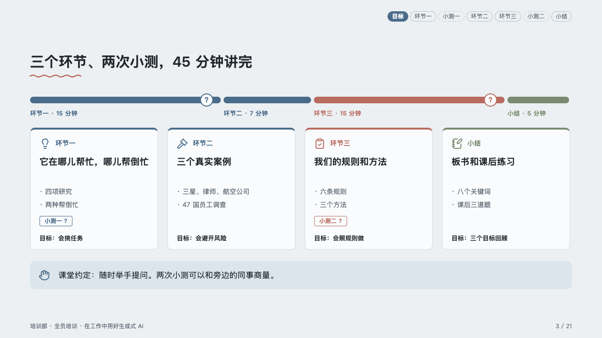
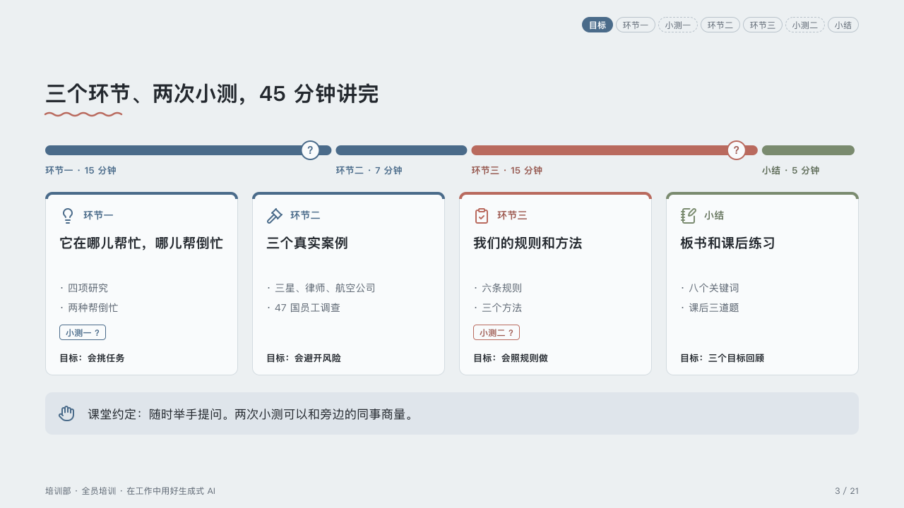

# syllabus

A class laid out by the minute: its parts to scale over a card each.

Code: [`src/layouts/compositions/syllabus.tsx`](../../../src/layouts/compositions/syllabus.tsx). The header comment there is the contract. The lesson setting only.

## homeroom, AI-at-work training sample, 2026-10

Settled on the agenda page (p03). The round's decisions are in [rounds/2026-10-06-homeroom](../../rounds/2026-10-06-homeroom/README.md).

| board (p03) | engine |
| :-: | :-: |
|  |  |

**What it looks like.** A bar of the whole class at the top, 14px tall and rounded, each part as long as its `duration`, its name and length under its start (「环节一 · 15 分钟」), and a question mark in a ring where a part ends on a `checkpoint`. Under it a card per part with a 4px top edge in the part's ink: its icon and name, its title bold at 19px, its `points` as a short list, its checkpoint as a pill with a question mark, and its rows at the foot (「目标：会挑任务」). The part the page is about (`emphasis`) is in the pen, the closing part of three or more in the palette's quieter ink, the others in the mark. Under the cards the classroom's rule in a tip box.

**Why.** The room should see at once how long the class runs, where the quizzes fall and which part is the one that matters.

**What it gave up.**

- A `roadmap` of two to four phases that all carry a duration, then optionally a `callout` with no title or tag.
- A part's name under the bar wider than the part, a title past two lines, more points than the card holds or a row past one line sends the page back.
- The bar's labels are composed from the phase's own `period`, `duration` and the roadmap's `duration_unit`.
