# table

A comparison set as an open ruled table, with the recommended option lifted onto its own column.

Code: [`src/layouts/compositions/table.tsx`](../../../src/layouts/compositions/table.tsx). The header comment there is the contract.

## brief, 2026-10

| board (p07) | engine |
| :-: | :-: |
| 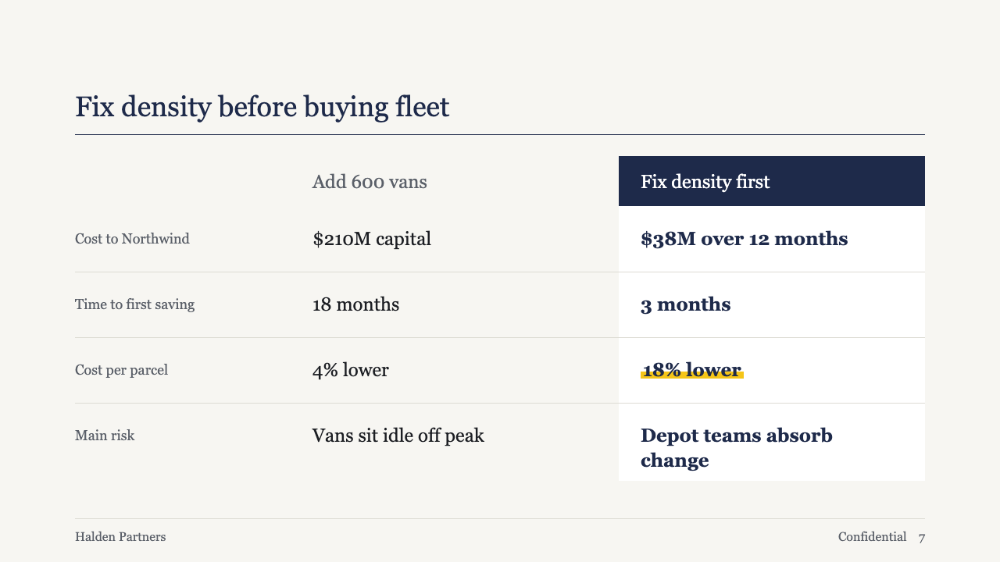 | 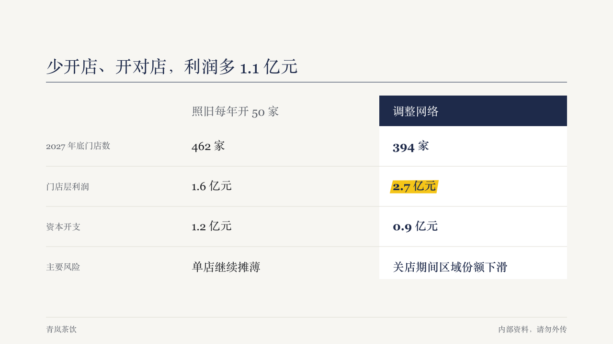 |

**What it looks like.** Row labels small (18px) and muted in a 280px column on the left. Options across the rest. The recommended option sits on a `surface` column that runs the table's full height, under a header reversed out of primary, with its values bold in primary. The other options have a muted header and values in body ink. Hairlines between rows, none under the last.

**Why.** The page exists to say "pick this one". A column on its own ground lets the eye read down the pick while the alternatives stay legible beside it, and the filled header marks the choice without colouring any words.

**What it gave up.**

- The lift needs the author to name the pick (`comparison.recommended`). Without it the table is plain, with no column favoured.
- Two or three options, at most five rows, headers in one line and cells in two at 24px. A bigger comparison goes back to the ordinary comparison component.
- The pick's column is only visible where `surface` differs from the page. On a theme whose card and page are the same colour, the pick is carried by its header and its bold type alone.
- A marked cell (`**…**`) takes the theme's highlight, measured against the column it sits on.

## brief, tea sample, 2026-10

| board (p09) | engine |
| :-: | :-: |
| 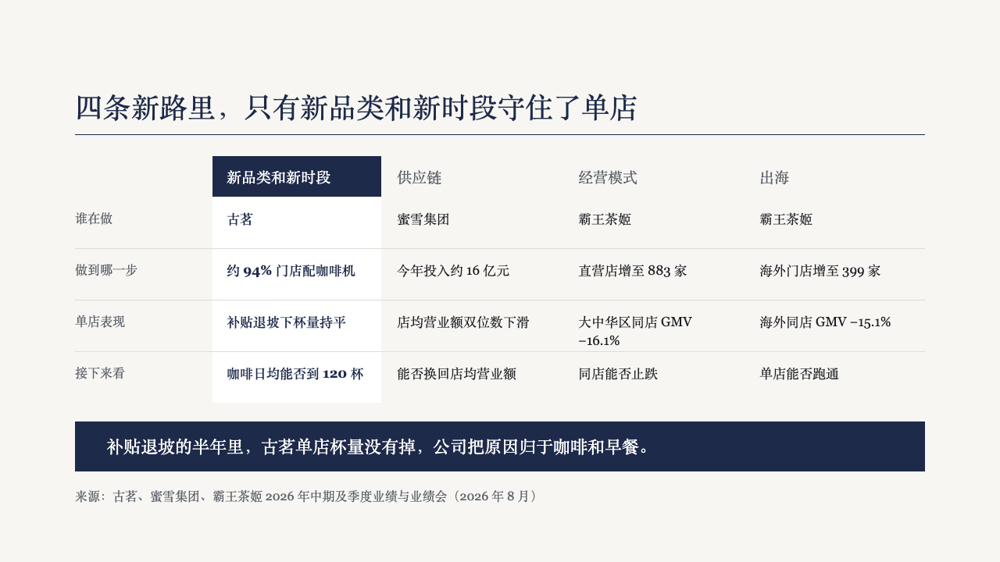 | 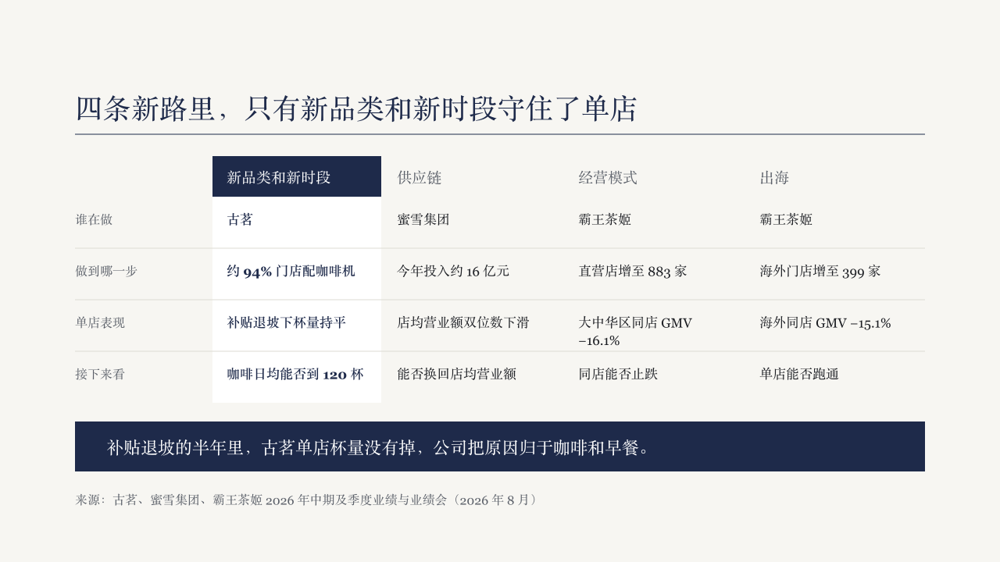 |

| board (p11) | engine |
| :-: | :-: |
| 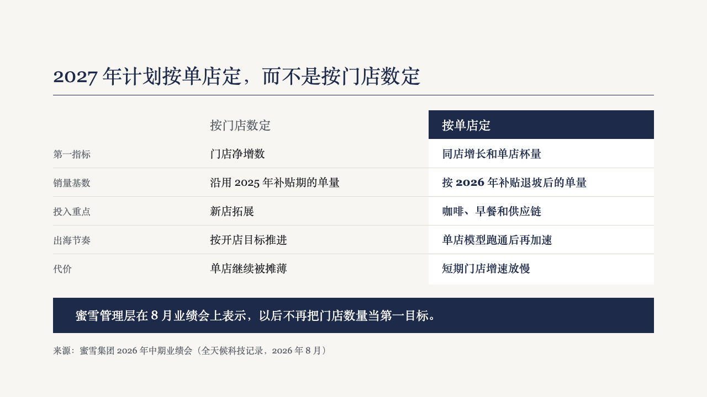 | 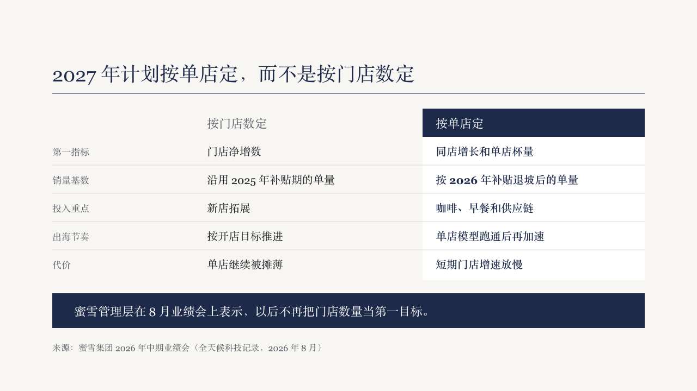 |

**What changed.** The table takes four options and a closing line, and steps down through two smaller sizes when the first board's does not hold it.

- compact (p11): 20px cells, 22px headers, 17px labels in a 260px column, a 52px header band, every row as tall as the tallest. The pick's column is 48px wider than a plain one (408px beside 360px on two options).
- dense (p09): 17px cells, 19px headers, 16px labels in a 170px column, every column 216px with 16px between them on four options, and every row room for two lines.

A closing `callout` sits 24px under the table in a full-width primary block at 22px, the block `rows` uses at its own size.

**Why.** Five rows over a closing line, or four options side by side, do not fit the first board's 24px table. The tea board drew both at smaller sizes rather than drop the closing line, and the sizes are a ladder the composition climbs down, the way `waves` steps its first measure from 36px to 24px.

**What it gave up.**

- The first board's size is still tried first, so a table that fit before is drawn exactly as before.
- Four options only at the dense size. Five rows at most at every size.
- The English copy of the sample was tightened to keep every cell within its line budget, since the sizes are fixed.

## bulletin, NEV sample, 2026-10

The notice setting. The round's decisions are in [rounds/2026-10-03-bulletin](../../rounds/2026-10-03-bulletin/README.md).

| board (p12) | engine |
| :-: | :-: |
|  | 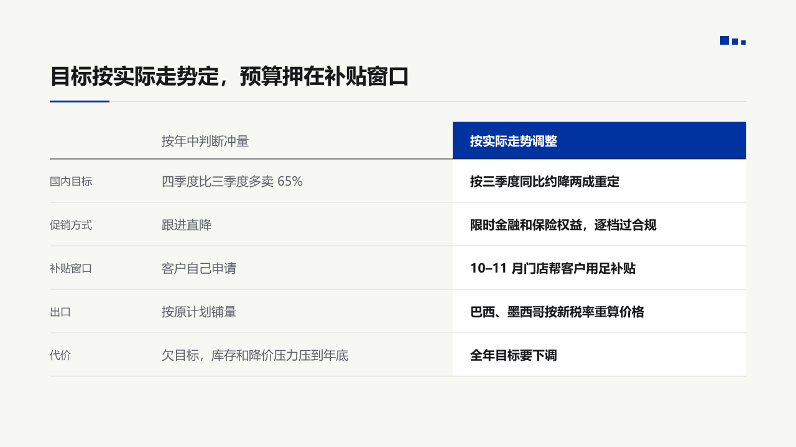 |

**What it looks like.** Row labels at 17px muted in a 170px column. The other options' cells at 20px muted. The recommended option's column lifted onto the surface with its header reversed out of a primary block, bold and white, and its cells black and bold. A rule in body ink under the header and a hairline under every row, the last one included.

**Why.** The recommended option is the page's answer, so it takes the page's one IKB, the header, and its cells read as the plan by weight alone. The other option is there to be rejected, so it is muted.

**What it gave up.**

- A closing callout becomes the light grey panel.

## ledger, AI capex sample, 2026-10

In the panel setting. The round's decisions are in [rounds/2026-10-04-ledger](../../rounds/2026-10-04-ledger/README.md).

| board (p14) | engine |
| :-: | :-: |
| 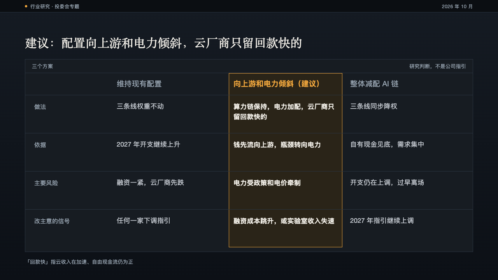 | 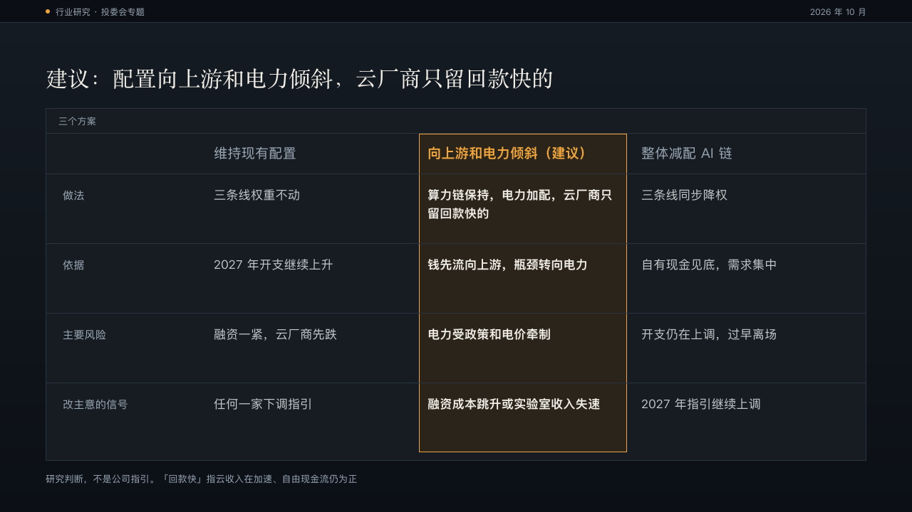 |

**What it looks like.** The options in a panel named by the comparison's `title`, one column each, the dimensions down a 212px label column. The recommended option stands on the dark amber tint inside a 1px amber edge, its header bold in amber with 「（建议）」 or " (recommended)" after it and its cells bold in the full ink. The other headers are muted at 19px and their cells a step quieter at 17px.

**Why.** The committee is asked to pick one of three. The pick is lifted out so the eye lands on it, and the other two stay readable as the alternatives.

**What it gave up.**

- Two to four options and one to five rows. A header past two lines, a cell past three or a label past two declines.
- The title bar prints no qualifier. "研究判断，不是公司指引" moved into the source line.

## vermilion, government work report sample, 2026-10

The seal setting's form, in [`table-seal.tsx`](../../../src/layouts/compositions/table-seal.tsx). The round's decisions are in [rounds/2026-10-04-vermilion](../../rounds/2026-10-04-vermilion/README.md).

| board (p04) | engine |
| :-: | :-: |
| 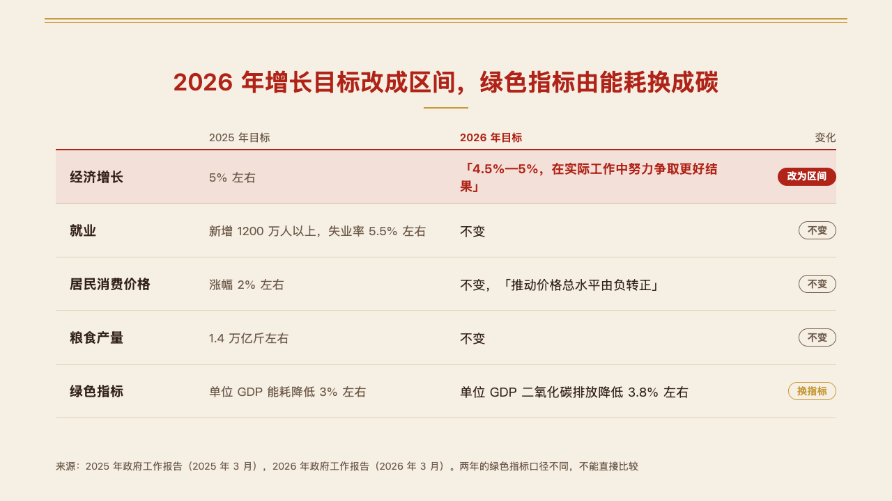 | 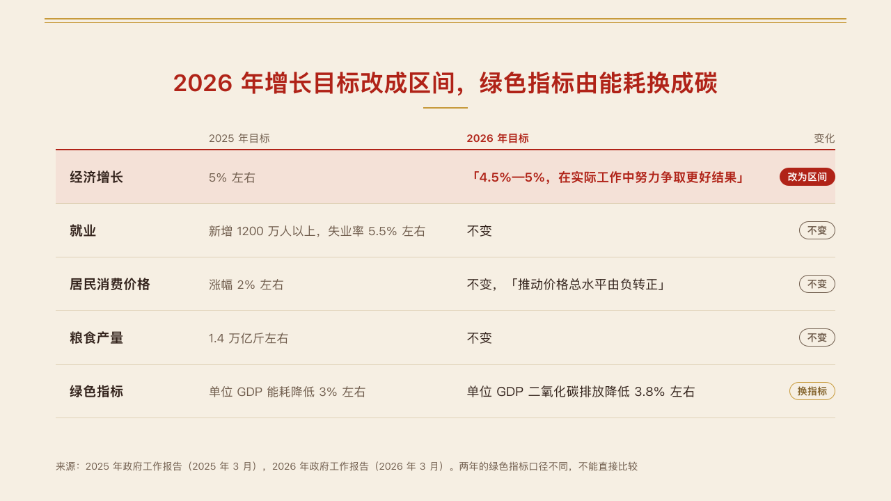 |

**What it looks like.** One `comparison` of up to three columns and six rows with no title, optionally followed by a `callout`. Headers at 15px over a 2px rule in the mark. Rows at least 76px tall on hairlines: the row's name bold at 19px, its cells at 17px in the quiet ink, the column the table reads toward (the recommended one, or else the later of two) with its header bold in the mark and its cells at 18px in the ink. Columns share the room by the length of what they hold. Each row's tag stands at the right edge under the `tag_column` header. The row the author marks sits on the mark's pale tint, its focus cell bold in the mark and its tag filled.

**Why.** Last year's targets against this year's: what changed is the point, so the change is a tag at the end of each row and the one change the page is about is the marked row.

**What it gave up.**

- A row name past one line, or a cell past two lines, declines.

## terminal, cloud outage review sample, 2026-10

The console setting's form, in [`table-console.tsx`](../../../src/layouts/compositions/table-console.tsx). The round's decisions are in [rounds/2026-10-05-terminal](../../rounds/2026-10-05-terminal/README.md).

| board (p12) | engine |
| :-: | :-: |
|  | 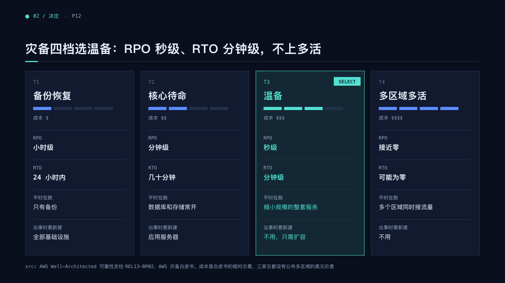 |

**What it looks like.** Each option of a `comparison` is a card: T1, T2… in mono, its name bold at 24px, its rows down the card on hairlines, the row's label in 12px mono and its value under it. The `recommended` option sits on the mark's tint inside an edge of it with a filled SELECT tag. A row whose cells are one symbol repeated ("$", "$$", "$$$") is a rating drawn as a meter under the name. A row named by a short code in capitals (RPO, RTO) sets its values in bold mono at 17px.

**Why.** Four tiers are four choices with a cost each. The pick reads as selected, not as a bolder column.

**What it gave up.**

- Two to five options and up to six rows, at most one rating, no `title`, row tags or marked row.

## clinic, GLP-1 formulary review sample, 2026-10

The dossier setting's form, in [`table-dossier.tsx`](../../../src/layouts/compositions/table-dossier.tsx). Settled on the formulary page (p13). The round's decisions are in [rounds/2026-10-05-clinic](../../rounds/2026-10-05-clinic/README.md).

| board (p13) | engine |
| :-: | :-: |
| 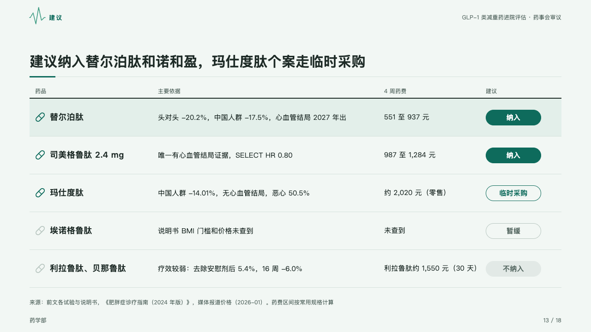 | 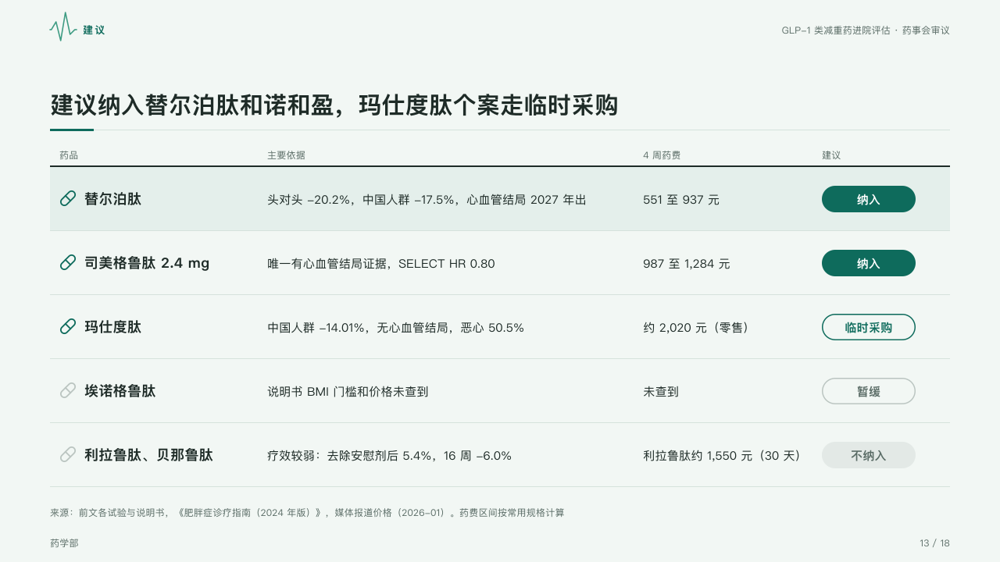 |

**What it looks like.** An open table under a 2px rule of ink, 82px a row: each option's icon and its name bold, its cells, and at the right the proposal as a capsule 120 by 34 that says how settled it is. A settled yes (`settled`, or the tag on the row the page marks) is filled with the mark, a conditional yes outlined in the mark, an open no or a deferral outlined in the ghost ink (`quiet`), a settled no filled in a quiet grey. A row's icon is in the mark when its proposal is a yes and in the ghost ink when it is not. The labels' column is named by `label_column`, the capsules' by `tag_column`, and the row the page is about sits on the mark's tint.

**Why.** A formulary decision is four answers, not two, and the room should see at a glance which are settled.

**What it gave up.**

- One `comparison` of one to three columns and two to five rows, every row with a tag, with no title or recommended column.
