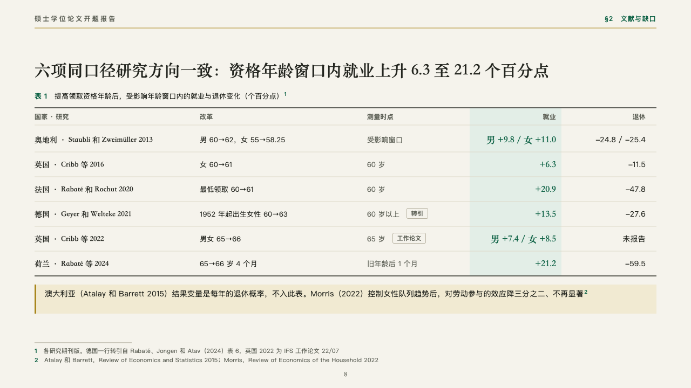
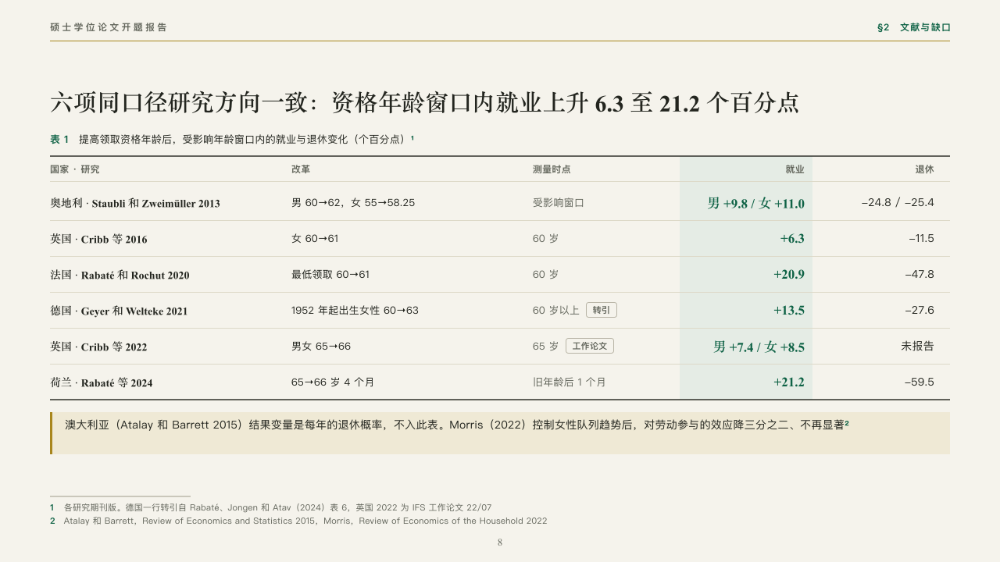

# tabulation

A table of comparable studies with the column the page is about.

Code: [`src/layouts/compositions/tabulation.tsx`](../../../src/layouts/compositions/tabulation.tsx). The header comment there is the contract. The manuscript setting only.

## thesis, retirement age thesis proposal sample, 2026-10

Settled on the table of studies (p08). The round's decisions are in [rounds/2026-10-06-thesis](../../rounds/2026-10-06-thesis/README.md).

| board (p08) | engine |
| :-: | :-: |
|  |  |

**What it looks like.** The table's number and title over an open table between two rules of ink: a row a study, its name in the heading serif, the words columns at 13px with the last in the grey, and the figure columns right-aligned, the marked one in emerald bold on a pale emerald band. A row's tag stands after the last words column as an outlined chip (「转引」, 「工作论文」). A caveat under the table on the pale gold with a gold bar.

**Why.** Six studies measured the same thing in the same way. Laid in one table with the employment column lit, the reader sees the range, 6.3 to 21.2 points, and what was left out says why.

**What it gave up.**

- Takes a titled `data_table` of three to seven columns, the right-aligned ones last and at most one of them marked, two to eight rows, then optionally a `callout`.
- A cell past one line of its column or a caveat past two lines sends the page back.
- The column widths are derived from what each column holds, within about three pixels of the board's.
