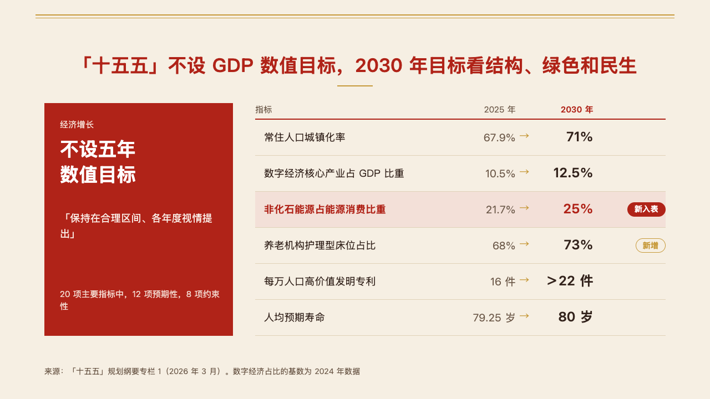
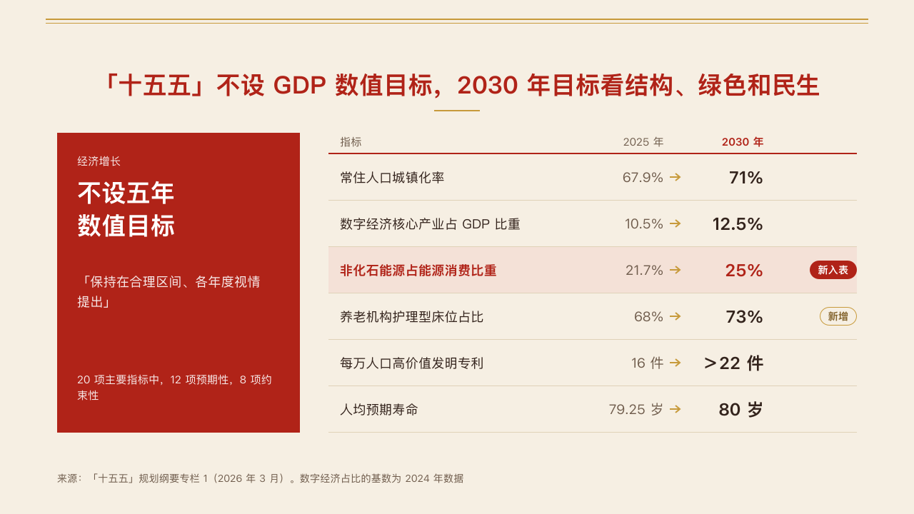

# targets

A plan's targets beside the one thing it says instead of a figure: a reversed block for the statement, an open table of the targets.

Code: [`src/layouts/compositions/targets.tsx`](../../../src/layouts/compositions/targets.tsx). The header comment there is the contract. The seal setting only.

## vermilion, government work report sample, 2026-10

The round's decisions are in [rounds/2026-10-04-vermilion](../../rounds/2026-10-04-vermilion/README.md).

| board (p07) | engine |
| :-: | :-: |
|  |  |

**What it looks like.** An `insight_panel` of one row followed by a `from_to`. On the left a 340px block reversed out of the mark: the panel's title at 15px, the row's label as the statement bold at 34/46, its text at 18/28 42px under it, and the panel's footnote at 15px 42px off the block's foot. A statement wider than half the block's measure is set on two even lines. On the right from x460, an open table: 15px headers over a 2px rule in the mark (the `from_to`'s `label_column` over the names), 64px rows on hairlines, each measure's name at 18px, its starting value in the quiet ink at 19px, an arrow in the accent, its target bold at 24px, and its tag at the right edge. Value and tag columns are 110px, wider only for a longer value or tag. The measure the author marks sits on the mark's pale tint, its name and target in the mark and its tag filled.

**Why.** The plan's headline is that it sets no growth figure. The block says so in the plan's own words, and the table shows what it does set.

**What it gave up.**

- No `kicker`, `span` or `change` on the `from_to`: the table has no place for them.
