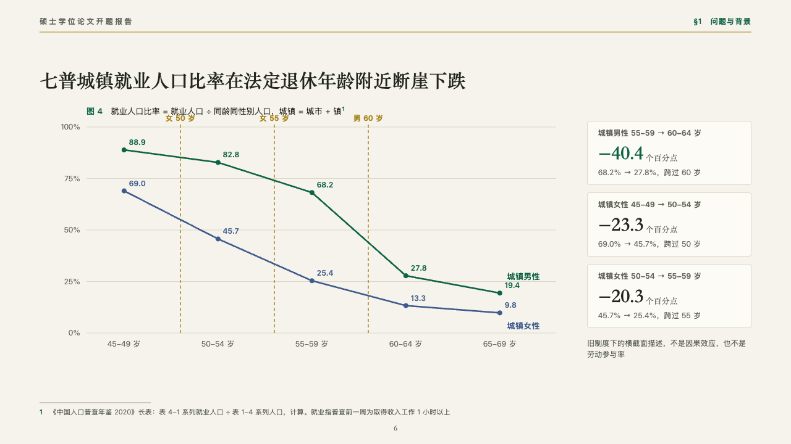
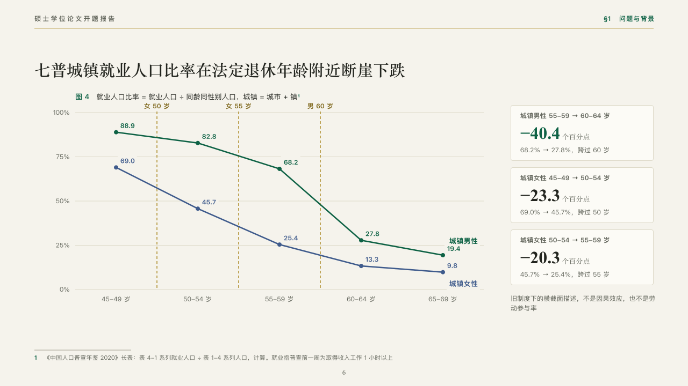

# thresholds

A line that falls at the ages a rule turns on.

Code: [`src/layouts/compositions/thresholds.tsx`](../../../src/layouts/compositions/thresholds.tsx). The header comment there is the contract. The manuscript setting only.

## thesis, retirement age thesis proposal sample, 2026-10

Settled on the employment cliff (p06). The round's decisions are in [rounds/2026-10-06-thesis](../../rounds/2026-10-06-thesis/README.md).

| board (p06) | engine |
| :-: | :-: |
|  |  |

**What it looks like.** The figure's number and title, one or two lines over hairlines with every point dotted and valued, each line named at its end, and a dashed gold line down the plot at each threshold (the chart's `markers`) with its name over it. At the right a card a drop: what it runs between, the drop set large in the heading serif with its unit, the marked one in emerald, and what it reads as. A line of caution under the cards.

**Why.** Employment falls off a cliff at the old statutory ages. The thresholds drawn on the plot show the drops line up with 50, 55 and 60, and the cards give each drop its size.

**What it gave up.**

- Takes a titled `line` chart with `markers`, one or two series over two to seven categories, a `kpi_cards` of one to three with notes, then optionally a `paragraph`.
- A card's line past its width or the caution past two lines sends the page back.
- The hairlines are cut clear of the point values, which the board drew through.
