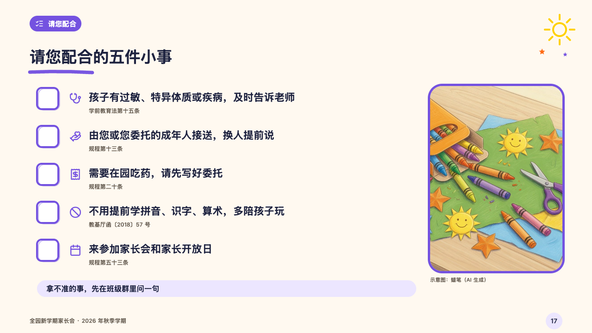

# ticks

A few things to do, each with a big box to tick.

Code: [`src/layouts/compositions/ticks.tsx`](../../../src/layouts/compositions/ticks.tsx). The header comment there is the contract. The crayonbox setting only.

## crayon, new term parents' meeting sample, 2026-10

Settled on p17. The round's decisions are in [2026-10-08-crayon](../../rounds/2026-10-08-crayon/README.md).

| board (p17) | engine |
| :-: | :-: |
|  |  |

**What it looks like.** A row a thing: a 46px empty box drawn twice in the section's crayon, the thing's symbol in the same crayon, the thing at 22px in heavy ink and where it is required under it in the grey (12px). At the right a photograph 286 by 400 in a frame of the section's crayon with its note under it, and under the rows the closing line on a pale strip of the crayon.

**Why.** Five favours asked of parents are a checklist they can take home.

**What it gave up.**

- Takes a `row_cards` of three to six, every row with a symbol, a title and words (where it is required), then an `image`, then optionally a `callout` with words alone.
- A row with a sub line, a mark or a tone, or a thing, its source or the closing line past one line send the page back.
