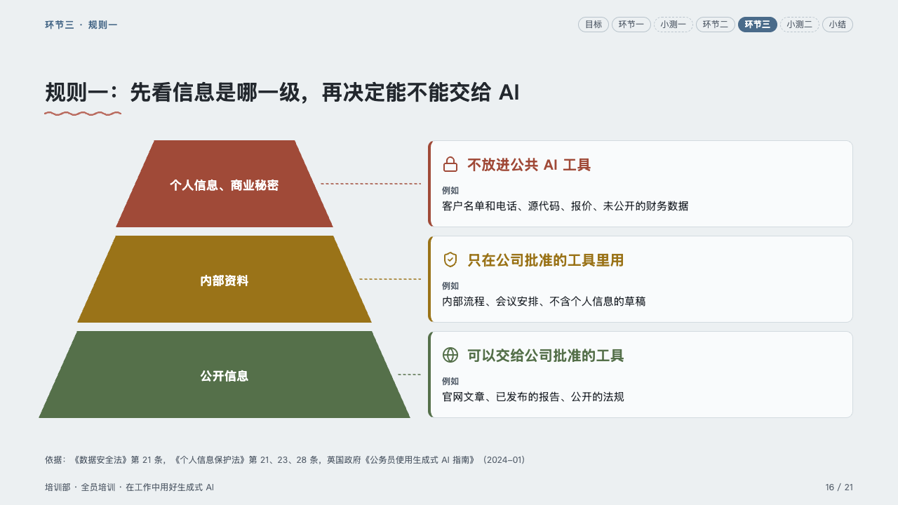
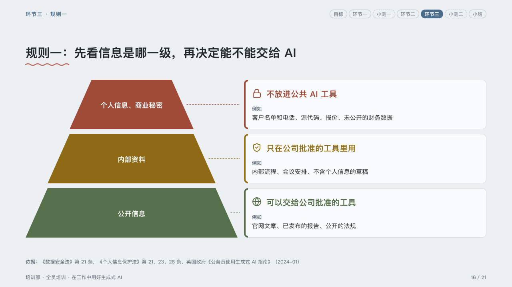

# tiers

Levels from the most guarded down, each with what to do with it.

Code: [`src/layouts/compositions/tiers.tsx`](../../../src/layouts/compositions/tiers.tsx). The header comment there is the contract. The lesson setting only.

## homeroom, AI-at-work training sample, 2026-10

Settled on the information grades page (p16). The round's decisions are in [rounds/2026-10-06-homeroom](../../rounds/2026-10-06-homeroom/README.md).

| board (p16) | engine |
| :-: | :-: |
|  |  |

**What it looks like.** A pyramid on the left, a band a level widening downward, each in its tone's ink (`layers[].tone`: red, amber, green) darkened only as far as a white name on it needs. From each band a dashed line in its ink runs right to a card: a 4px edge in the band's ink down its left, its icon and what to do bold in that ink, then 「例如」 muted over the examples when the card's text is written 「例如：…」.

**Why.** Grading comes before deciding: the pyramid says how guarded each level is, the card what that means for the tool.

**What it gave up.**

- A `pyramid` of two to four levels with no notes, then an `icon_cards` with one card per level.
- The pyramid sits nine pixels right of the board's so its base stays inside the band.
