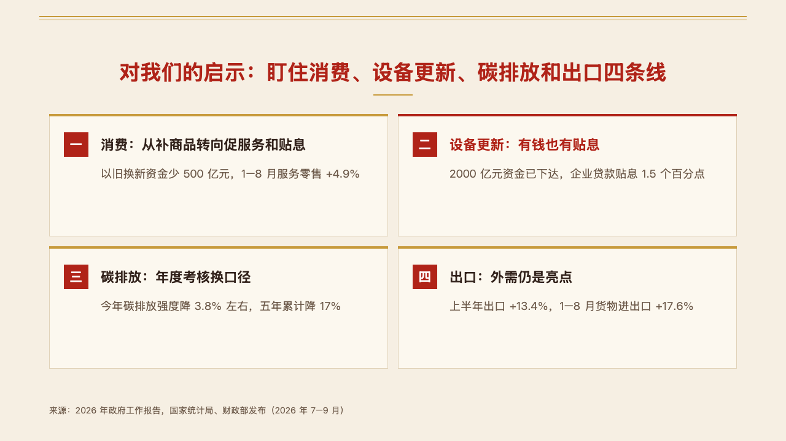
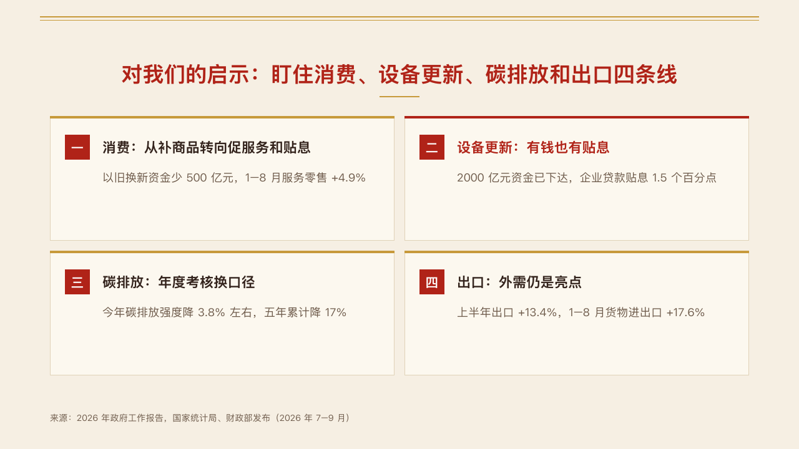

# tiles

Numbered cards as numbered panels: two by two for four, in a row for three, the number in each panel's title bar.

Code: [`src/layouts/compositions/tiles.tsx`](../../../src/layouts/compositions/tiles.tsx). The header comment there is the contract. The panel setting only.

## ledger, AI capex sample, 2026-10

Settled on the conclusion page. The round's decisions are in [rounds/2026-10-04-ledger](../../rounds/2026-10-04-ledger/README.md).

| board (p02) | engine |
| :-: | :-: |
|  |  |

**What it looks like.** One `numbered_cards` of three or four items. Each item is a 236px panel whose title bar carries its number ("01") and, when the author wrote one, its `sub` on the right. Under the bar the title at 28/40 in the heading face and the text at 19/30. The item the author marked (`emphasis`) takes amber for its edge, its number and its title, and its text steps up to the full ink.

**Why.** A conclusion in four parts reads as four quotes on a screen. The number in the bar keeps the order without a large numeral beside each card, which is what the old points page drew.

**What it gave up.**

- Three or four items. Five or more, a title past two lines, a text past three, or a panel too short for its words decline, and the page goes to the ordinary numbered cards.
- The other settings keep setting numbered cards as rows: tiles has no form outside the panel setting.

## vermilion, government work report sample, 2026-10

The seal setting's form, in [`tiles-seal.tsx`](../../../src/layouts/compositions/tiles-seal.tsx), offered first on vermilion's list pages (`cards: "tiles"`). The round's decisions are in [rounds/2026-10-04-vermilion](../../rounds/2026-10-04-vermilion/README.md).

| board (p14) | engine |
| :-: | :-: |
|  |  |

**What it looks like.** One `numbered_cards` of two, four or six items with no `sub`, two panels to a row 16px apart. Each panel is the surface with a hairline edge and a 4px bar along its top in the accent, a 40px numbered square, the title bold at 22/32 and the text at 18/28. The item the author marks takes the mark for its bar and its title.

**Why.** Implications are peers, and two by two reads as a grid of things to watch rather than a sequence.

**What it gave up.**

- An odd count, a `sub`, or a title or text past two lines declines, and the numbered rows set the cards.
