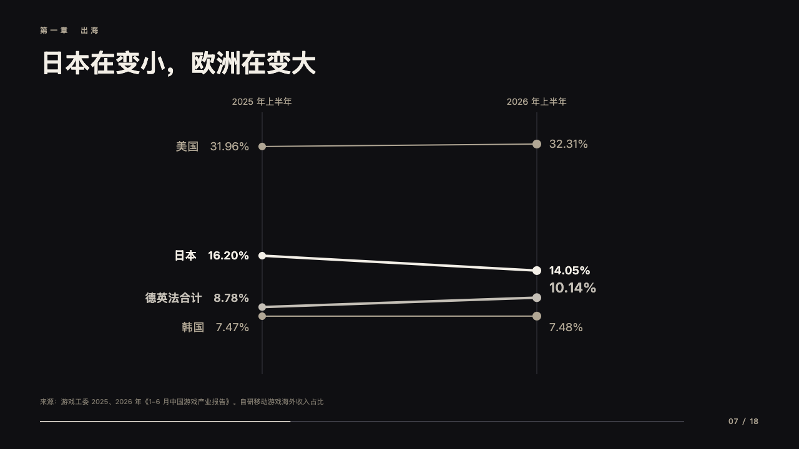
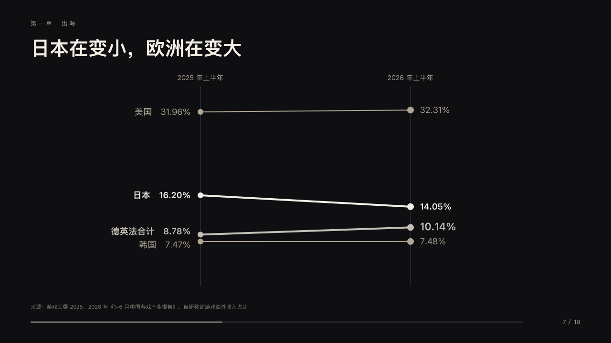

# tilt

A slope chart.

Code: [`src/layouts/compositions/tilt.tsx`](../../../src/layouts/compositions/tilt.tsx). The header comment there is the contract. The keynote setting only.

## stage, game developers keynote sample, 2026-10

Settled on p07. The round's decisions are in [2026-10-08-stage](../../rounds/2026-10-08-stage/README.md).

| board (p07) | engine |
| :-: | :-: |
|  |  |

**What it looks like.** Two upright hairlines at x420 and x860 from y180 to y600, each time named at 14px over its axis, one line a row from its earlier value to its later on one scale. A row that moved by a twentieth of where it started or more is 4px in the paper white, a row that held 2px in the sand, the marked row 4px in silver. Each row's name and earlier value at the left end, its later value at the right, labels that would touch moved 28px apart.

**Why.** Shares that shift a point or two a year read as movement only when both ends sit side by side.

**What it gave up.**

- Takes a `from_to` of three to six rows with numeric values. The board placed the crowded labels by hand. The engine spreads them by one rule.
