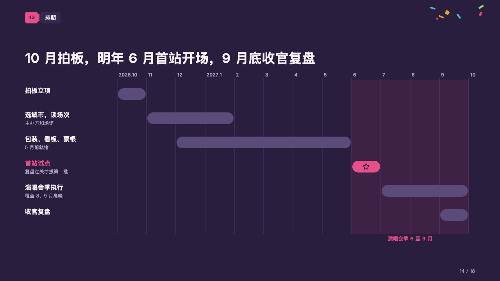
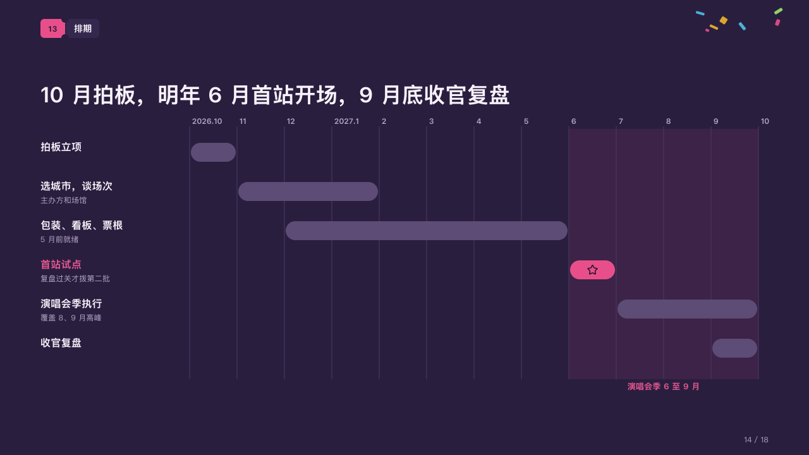

# timetable

A plan month by month, with its season tinted and the first stop starred.

Code: [`src/layouts/compositions/timetable.tsx`](../../../src/layouts/compositions/timetable.tsx). The header comment there is the contract. The marquee setting only.

## rally, summer concert season proposal sample, 2026-10

Settled on the schedule page (p14). The round's decisions are in [rounds/2026-10-06-rally](../../rounds/2026-10-06-rally/README.md).

| board (p14) | engine |
| :-: | :-: |
|  |  |

**What it looks like.** A thin rule at every month of the axis with its label beside its top, the season the plan is built around (the gantt's `bands`) tinted in the magenta behind the bars and named in the magenta under them. A row a piece of work: its name bold at the left with a grey line under it, its bar a rounded capsule over its stretch in the dim violet; the bar the page is about in the magenta, its name in the magenta, and a row's icon set on its bar (the star on the first stop).

**Why.** A schedule is read against the season it has to hit. Tinting June to September behind the bars shows the first stop and the run that follow it land inside it.

**What it gave up.**

- A `gantt` of two to six rows with no period, at most one marked, with axis labels (one a month, the first at the axis's start and the last at its end) and at most one band.
- A name past its column, a row's line past one line, a tick label wider than its month, the band's name past one line or a bar too narrow for its icon sends the page back.
