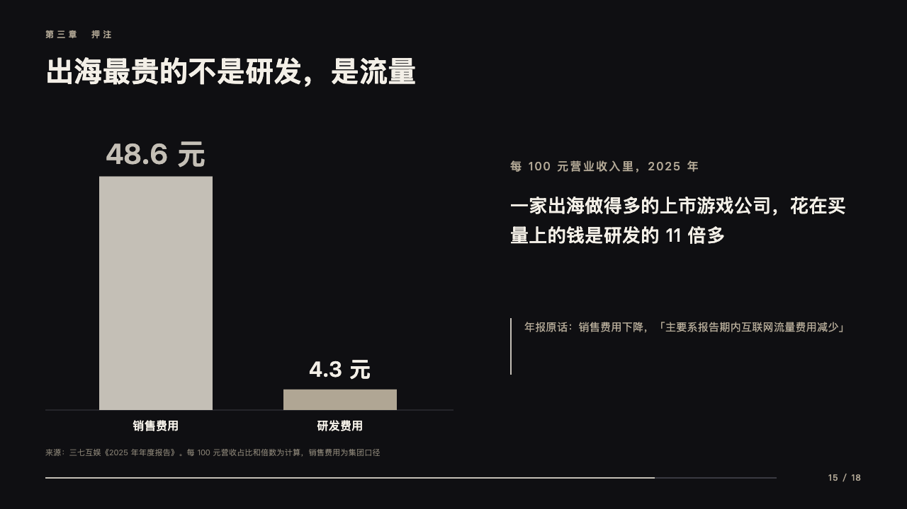
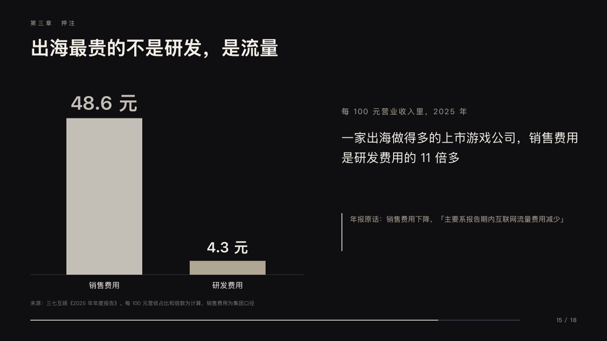

# toll

Two bars beside the sentence their gap says.

Code: [`src/layouts/compositions/toll.tsx`](../../../src/layouts/compositions/toll.tsx). The header comment there is the contract. The keynote setting only.

## stage, game developers keynote sample, 2026-10

Settled on p15. The round's decisions are in [2026-10-08-stage](../../rounds/2026-10-08-stage/README.md).

| board (p15) | engine |
| :-: | :-: |
|  |  |

**What it looks like.** At the left two or three bars 160px wide standing on a hairline on y580, to a round ceiling at 340px, each value bold over it (40px in silver for the marked one, 30px otherwise) and its name at 16px under the line. At the right from x720: what the bars count at 16px tracked 2px (the series, after the chart's title when it has one), the sentence at 26/42 from y270, and the `callout` as 「title：text」 at 15/26 in the sand behind a 2px silver rule from y450.

**Why.** A ratio the room has to feel: one bar towers over the other, and the sentence says what it costs.

**What it gave up.**

- Takes a bar chart of two or three values, a `paragraph` and an informing `callout` with a title.
- The sample says selling expenses ran more than 11 times R&D, where the board said money spent on buying users: the expense is group-wide and not all user acquisition.
