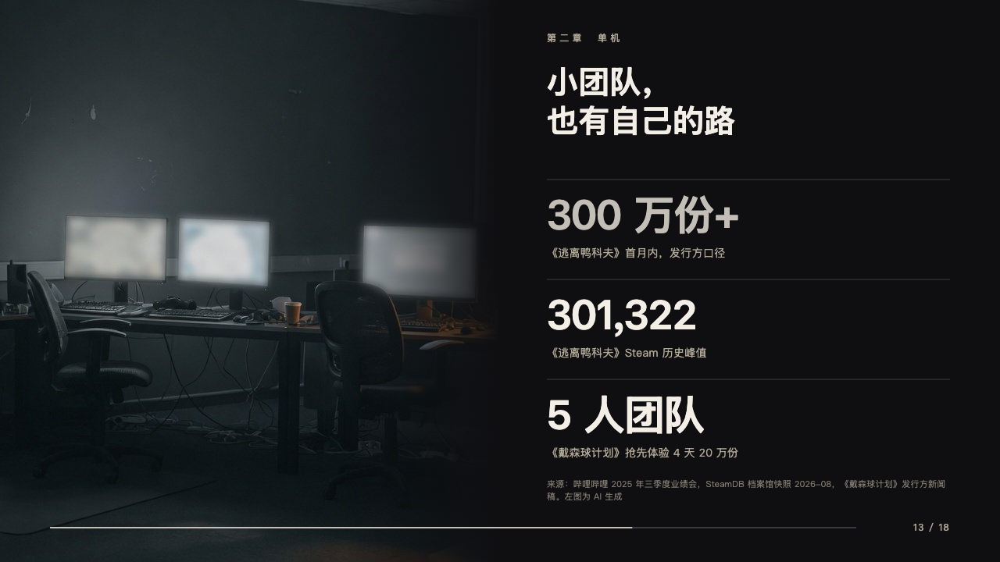
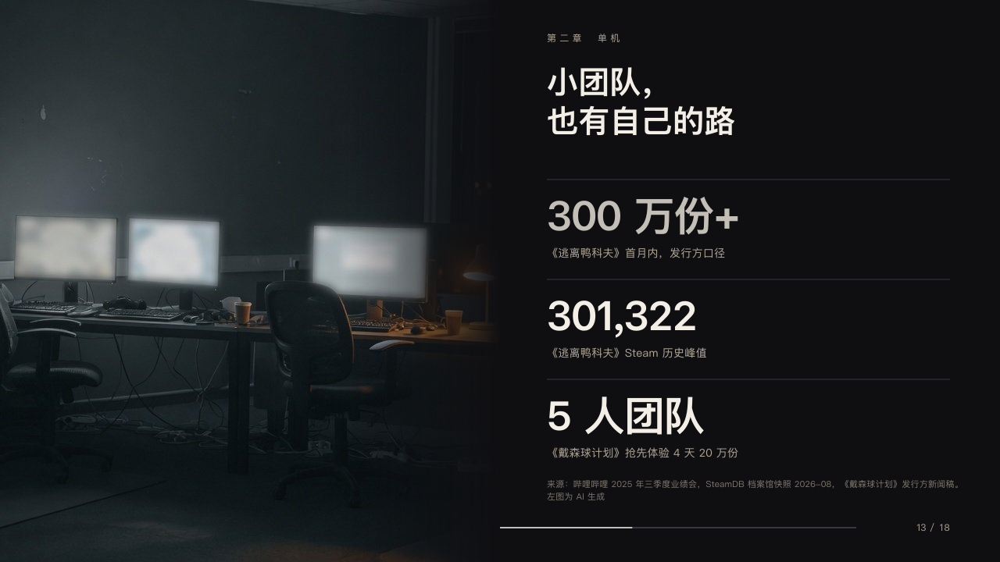

# tower

A photograph beside stacked figures.

Code: [`src/layouts/compositions/tower.tsx`](../../../src/layouts/compositions/tower.tsx). The header comment there is the contract. The keynote setting only.

## stage, game developers keynote sample, 2026-10

Settled on p13. The round's decisions are in [2026-10-08-stage](../../rounds/2026-10-08-stage/README.md).

| board (p13) | engine |
| :-: | :-: |
|  |  |

**What it looks like.** The photograph fills x0 to x640 full height, fading into the black over its last 200px. In the right column from x700: the chapter at y40, the claim bold at 40/50 from y80 on one line or the author's two, and two or three figures every 128px from y230, each under a hairline, bold at 52px closed up 1px with its line at 14px in the sand. The marked figure is silver, or the first. The source at the foot of the column.

**Why.** A picture of the room it happened in, and the three numbers that prove it can happen.

**What it gave up.**

- Takes an `image` and the figures as one `kpi_cards` of two or three or as two or three `kpi_cards` of one.
