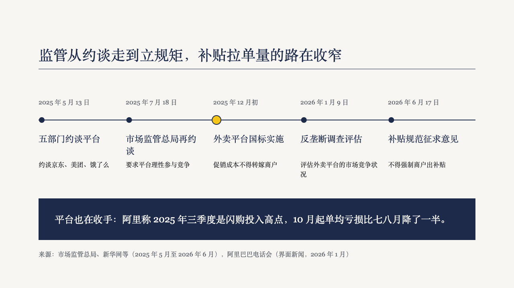
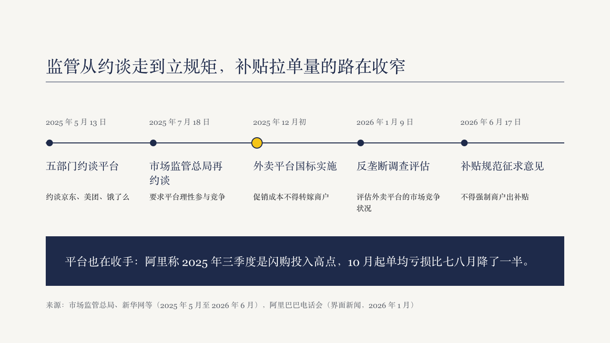

# track

A timeline set on one rule across the page, a dot for each milestone, the date above the rule and the title and description below it, with the page's closing line in a primary block under them.

Code: [`src/layouts/compositions/track.tsx`](../../../src/layouts/compositions/track.tsx). The header comment there is the contract.

## brief, tea sample, 2026-10

| board (p08) | engine |
| :-: | :-: |
|  |  |

**What it looks like.** A 2px primary rule 100px into the band, from edge to edge. Milestones share the width. Each has a 7px primary dot 8px into its column, the date at 16px muted above the rule, the title at 22px in primary within two lines and the description at 16px in body ink within two lines below it. A milestone marked `highlight` takes an 11px dot in the accent, ringed in primary. The closing line sits in a full-width primary block at 24px, 296px into the band.

**Why.** A regulatory story reads as dates on one line, and the reader only needs to know which date changed the rules. The highlight dot says that without a second colour anywhere else. The closing block says why the dates matter for the plan.

**What it gave up.**

- Two to six milestones running across the page. A vertical timeline, or more milestones, goes to the ordinary timeline component.
- Titles and descriptions keep to two lines each at the board's sizes, or the page goes back to the face.
- The board had a one-line closing block. A two-line one rises toward the milestones, keeping 20px clear of them, so it still ends above the source line.
