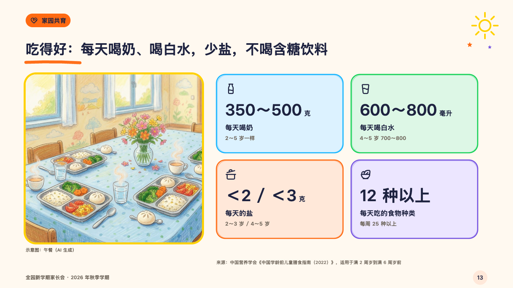
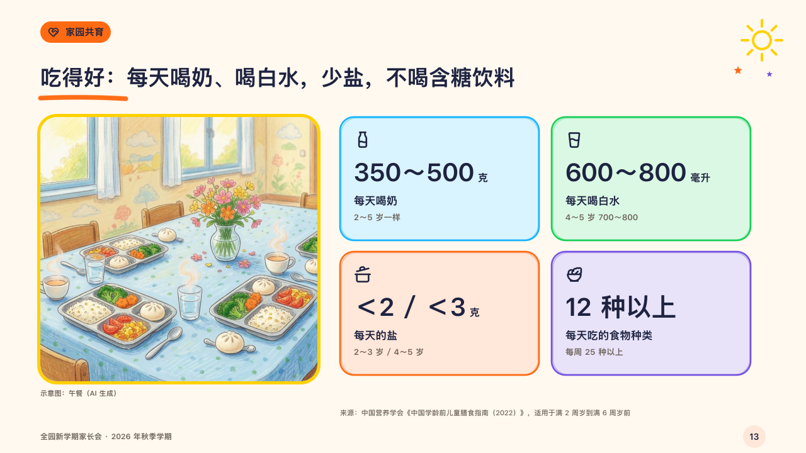

# tray

A photograph in a yellow crayon frame beside a few figures to remember.

Code: [`src/layouts/compositions/tray.tsx`](../../../src/layouts/compositions/tray.tsx). The header comment there is the contract. The crayonbox setting only.

## crayon, new term parents' meeting sample, 2026-10

Settled on p13. The round's decisions are in [2026-10-08-crayon](../../rounds/2026-10-08-crayon/README.md).

| board (p13) | engine |
| :-: | :-: |
|  |  |

**What it looks like.** The photograph on the left, 440 by 420, in a 5px yellow frame with its note under it. Beside it the figures two by two on cards drawn by hand, 316 by 196, each in its own crayon: the symbol, the figure at 40px with its unit at 16px, what it is (17px) and in the grey for whom (13px). The source stands under the cards.

**Why.** A lunch tray and four numbers a parent can keep in mind are the whole of the nutrition advice that fits a meeting.

**What it gave up.**

- Takes an `image`, then a `kpi_cards` of two to four, every card with a symbol and a label.
- A card with a tag, a delta, a tone or a source, or a figure, label or note past one line send the page back.
