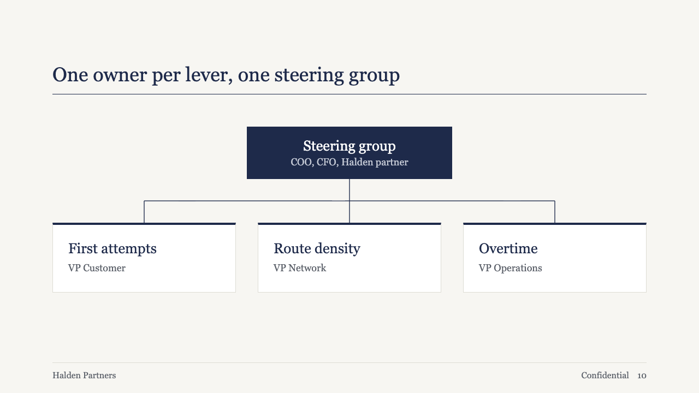
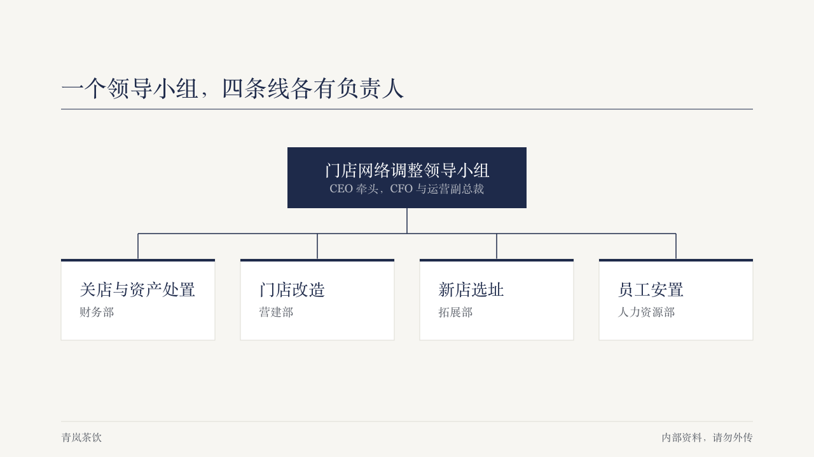

# tree

A two-level team: one owner block over a row of cards, joined by a square connector.

Code: [`src/layouts/compositions/tree.tsx`](../../../src/layouts/compositions/tree.tsx). The header comment there is the contract.

## brief, 2026-10

| board (p10) | engine |
| :-: | :-: |
|  |  |

**What it looks like.** The owner in a 376 by 96 primary block at the top centre, name at 26px in white and role at 18px in a quiet grey. A 1.5px primary connector, square, down to a bus and down again to each card. Cards on `surface` with a 1px border and a 4px primary rule on top, name at 26px in primary and role at 18px muted. When one card needs a second line, every card grows with it.

**Why.** A steering page answers "who owns what", and one level under the owner is all it needs. The square connector reads as an org chart at a glance without the density of the full chart component.

**What it gave up.**

- Two levels only, two to four branches. A deeper tree goes to the ordinary org chart.
- The owner's role sits on primary in a colour no theme token names. brief hands in its board grey (#B7BBC4). Other themes get the block's readable ink blended about two thirds of the way back toward the block, which on brief's navy gives #B7BBC5, one unit off the board's grey. Contrast still decides in both cases.
