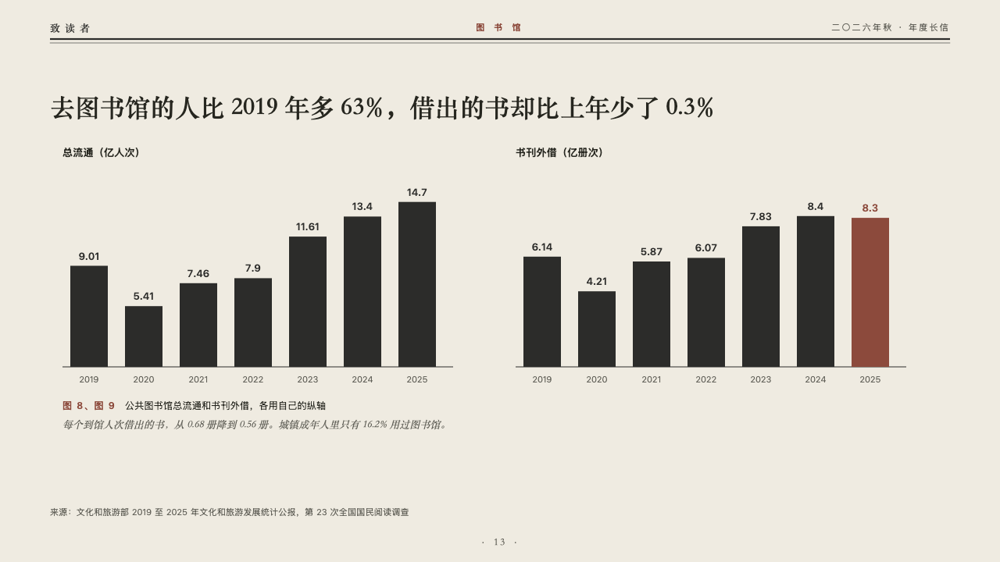
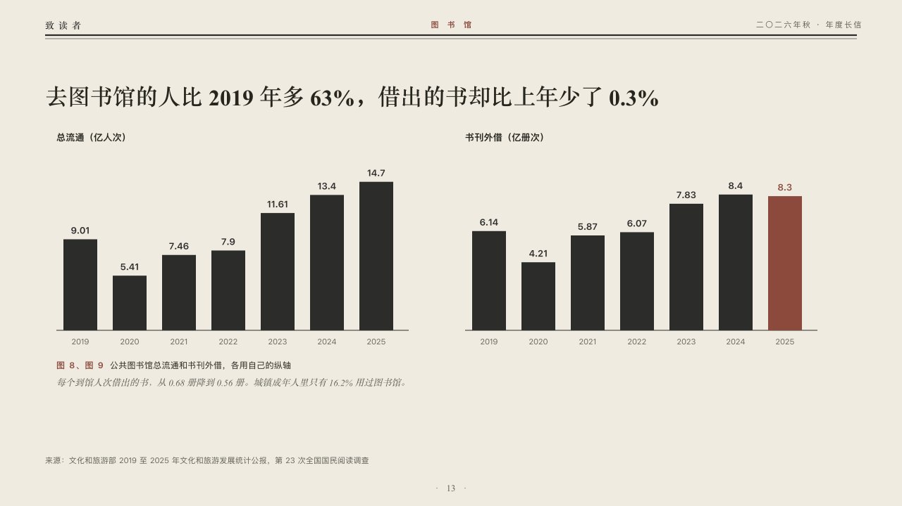

# twins

Two small multiples of one run, each on its own scale.

Code: [`src/layouts/compositions/twins.tsx`](../../../src/layouts/compositions/twins.tsx). The header comment there is the contract. The periodical setting only.

## journal, annual letter to readers sample, 2026-10

Settled on p13. The round's decisions are in [2026-10-07-journal](../../rounds/2026-10-07-journal/README.md).

| board (p13) | engine |
| :-: | :-: |
|  |  |

**What it looks like.** The claim over the page. Under it two bar charts side by side, each named over its plot by its series and unit, every value over its bar as the author wrote it, the marked bar in brick red. No axis is shared and none is drawn. Under them one caption for both, the two figures' numbers before their shared title, and the editor's comment.

**Why.** Visits and loans are counted in different units. One shared axis would ask the reader to compare heights that mean nothing together.

**What it gave up.**

- Takes two upright bar charts of one series each, three to seven values above zero, both with the same title, then optionally a `callout` with words alone.
- A tag, ranges, gaps, changes, a reference, statuses or axis titles leave the charts to the ordinary renderer.
