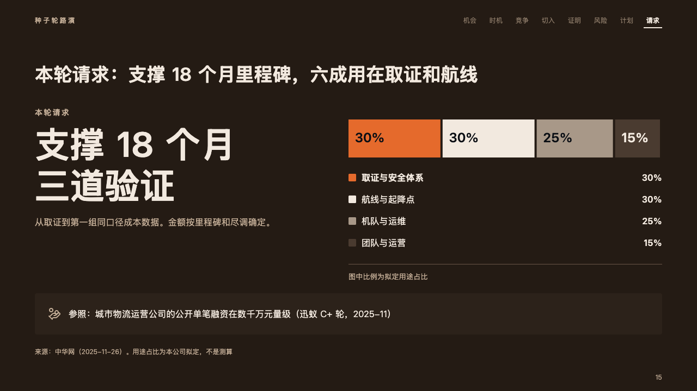
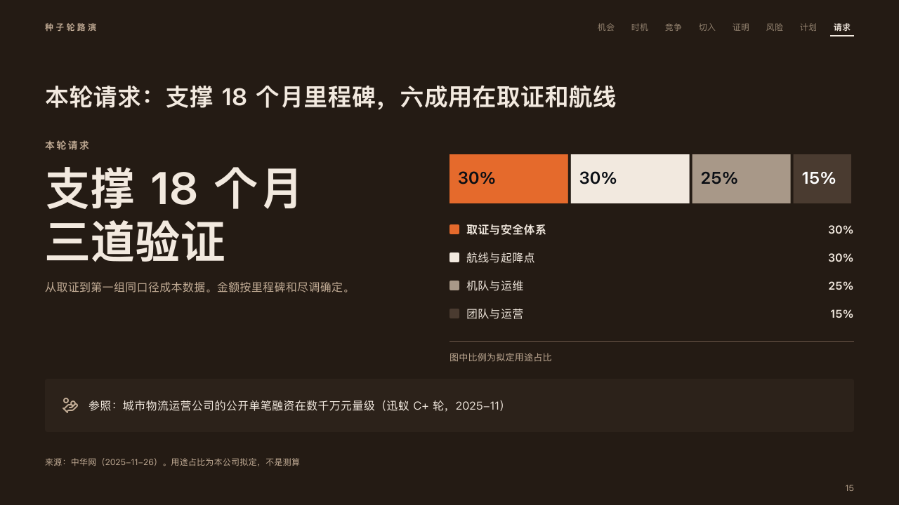

# uses

What a round asks for and where its money goes: the ask large at the left, one bar cut by share at the right.

Code: [`src/layouts/compositions/uses.tsx`](../../../src/layouts/compositions/uses.tsx). The header comment there is the contract. The pitch setting only.

## ember, low-altitude delivery pitch sample, 2026-10

Settled on the ask page (p15). The round's decisions are in [rounds/2026-10-06-ember](../../rounds/2026-10-06-ember/README.md).

| board (p15) | engine |
| :-: | :-: |
|  |  |

**What it looks like.** At the left the ask: what it is at 14px tracked in the warm grey, the ask itself at 64/76 bold in up to two lines (「支撑 18 个月 / 三道验证」, "18 months, / three tests"), and a note under it at 16px in the warm grey. At the right, from x640, one bar 70px tall cut into the money's uses, each part as long as its share and named by its share inside it at 24px bold (the chart's unit, 「30%」), the first in the fire and the rest stepping back (the ivory, the palette's quietest ink, the dark band). Under the bar a key, a swatch, a name and a share a row, then a hairline and the bar's caption. Under both, in a card, what the ask is measured against, with its icon.

**Why.** An ask is credible when the room can see what it buys. The share bar answers that in one look, and the fire on the first part says where most of the money goes.

**What it gave up.**

- A `kpi_cards` of one item with no delta, tone, icon, source, tag or unit, then a share bar (`chart`, stacked, horizontal) of two to five parts with none marked and no `emphasis_label`, then optionally a `callout` with no title or tag. A share is printed with `axes.y_unit`.
- The ask's label past one line, the ask past two lines, its note past two lines, a share wider than its part, a name past one line, the caption past one line, or the card's words past two lines sends the page back.
