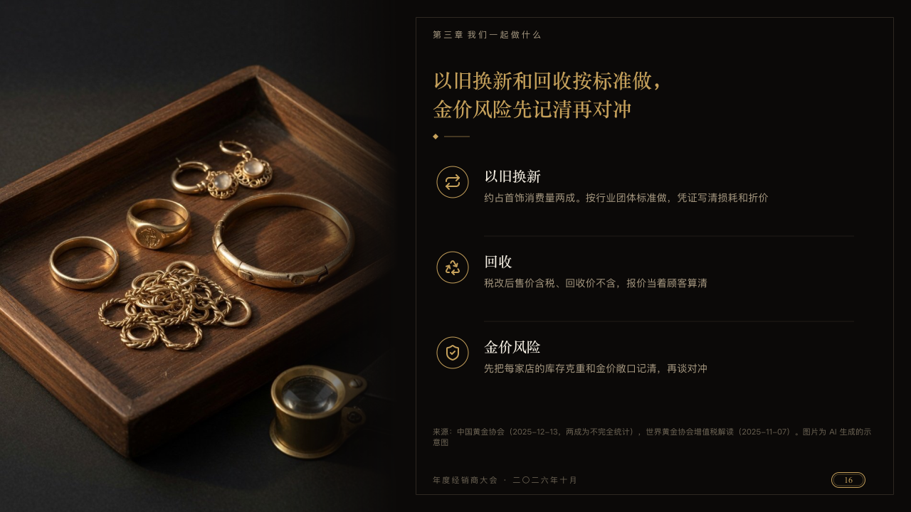

# vitrine

A photograph down the left half of the page beside what the page asks.

Code: [`src/layouts/compositions/vitrine.tsx`](../../../src/layouts/compositions/vitrine.tsx). The header comment there is the contract. The invitation setting only.

## luxe, gold dealer conference sample, 2026-10

Settled on p16. The round's decisions are in [2026-10-08-luxe](../../rounds/2026-10-08-luxe/README.md).

| board (p16) | engine |
| :-: | :-: |
|  |  |

**What it looks like.** The photograph runs from the page's left edge to x560, fading into the stock at its right. The card stock's frame and the occasion at the foot move beside it (the group says `data-frame-left`, which the motif reads). In the right half the chapter, the claim in the gold serif at 28px set from the left, a gold diamond with one rule after it, then each item with its symbol in a gold ring, its name in the ivory serif and a line or two in old gold.

**Why.** A service promise is concrete. A photograph of the counter's tray carries the half of it words cannot.

**What it gave up.**

- Takes an `image` with no caption, then an `icon_cards` of two or three items with no title, tag or tone.
- A name past one line, a line past two, or a claim that does not fit the half page, sends the page back.
