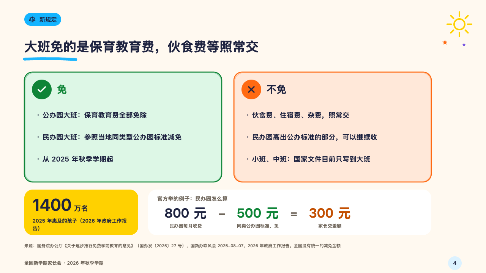
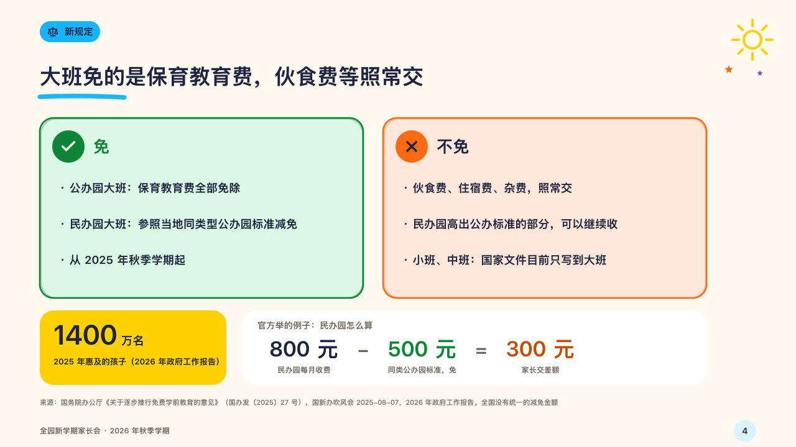

# waiver

What a rule covers and what it does not, with its reach and a worked example.

Code: [`src/layouts/compositions/waiver.tsx`](../../../src/layouts/compositions/waiver.tsx). The header comment there is the contract. The crayonbox setting only.

## crayon, new term parents' meeting sample, 2026-10

Settled on p04. The round's decisions are in [2026-10-08-crayon](../../rounds/2026-10-08-crayon/README.md).

| board (p04) | engine |
| :-: | :-: |
|  |  |

**What it looks like.** Two cards drawn by hand side by side, 520 by 290: what is in, in the leaf green with a check in a green disc and its name in green, and what is out, in the tangerine with a cross in an orange disc. Each line the author wrote into a card's text is a point of its own (18/26). Under them a sunny yellow block with the reach set large (`kpi_cards` of one, 44px with its unit at 18px) and a white block with the example worked out as a sum across it (`waterfall` with a `title`): the title in the grey, then each figure (34px) with what it is under it, the figure taken away in the leaf green, the amount left in the burnt orange, a minus or a plus between them and an equals before the total.

**Why.** A fee policy is understood by what it does not cover, and the official example only lands when the sum is written out.

**What it gave up.**

- Takes an untitled `icon_cards` of two with symbols and one to three lines each, a `kpi_cards` of one with a label, and a titled `waterfall` of two to four items whose last is the total they add up to.
- A card with a tag or a tone, a figure card with a note, a tag, a delta, a source or a symbol, a waterfall with notes or marks or one that does not add up send the page back.
- A figure's slot widens past the board's 150px when a figure or its label needs it and the sum still fits.
