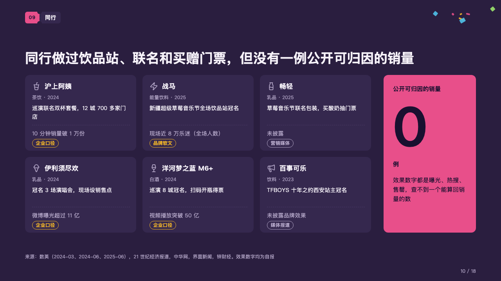
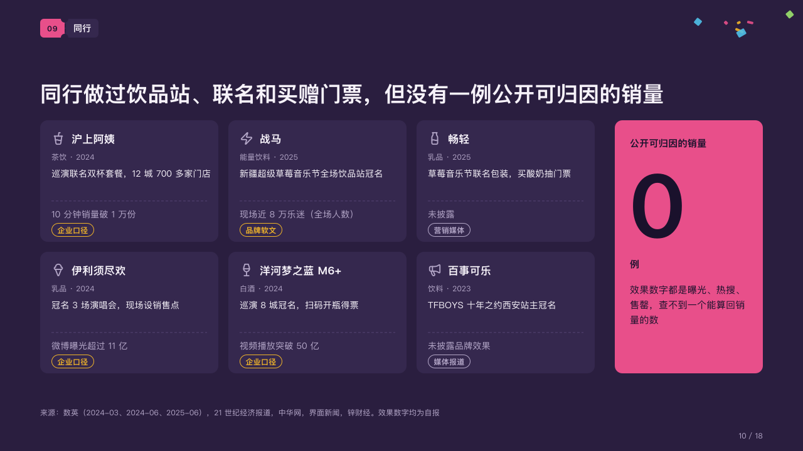

# wall

What peers have done and what they could show for it, beside the count the page lands on.

Code: [`src/layouts/compositions/wall.tsx`](../../../src/layouts/compositions/wall.tsx). The header comment there is the contract. The marquee setting only.

## rally, summer concert season proposal sample, 2026-10

Settled on the peers page (p10). The round's decisions are in [rounds/2026-10-06-rally](../../rounds/2026-10-06-rally/README.md).

| board (p10) | engine |
| :-: | :-: |
|  |  |

**What it looks like.** A wall of cards three to a row, each a case: its icon and name, a grey line of its trade and year, what it did, a dashed rule, what it reported in grey, and a tag of where that report comes from, outlined in the ink its kind of source takes (「企业口径」, 「媒体报道」). Beside the wall one card of the magenta holding the count huge in the dark ink (「0」), what it counts over it, its unit and its note under it.

**Why.** Peers spent on concerts and reported reach, never sales. A wall of their own claims, each labelled with its source, beside a zero makes the gap the proposal fills.

**What it gave up.**

- A card's title is written "name · trade · year" and its text "what was done。what came of it". The full stop is declared on the deed's last line, not printed.
- An `icon_cards` of two to six, each with a tag; then a `kpi_cards` of one item with no delta, icon, tag or source.
- A name or a trade past one line, a deed past two lines, a result past one line, a tag wider than its card or the count's words past their lines sends the page back.
