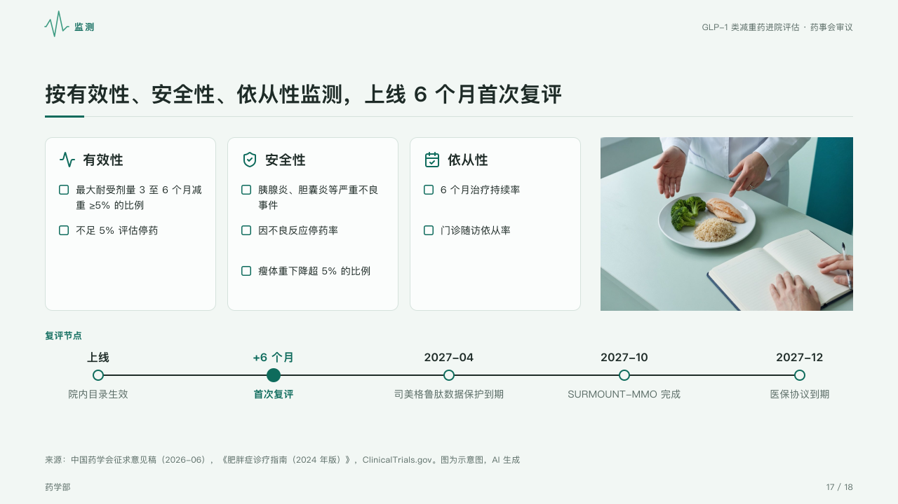

# watch

What to check and when to look again: a card for each kind of check with boxes to tick, a photograph, and the review dates on one axis.

Code: [`src/layouts/compositions/watch.tsx`](../../../src/layouts/compositions/watch.tsx). The header comment there is the contract. The dossier setting only.

## clinic, GLP-1 formulary review sample, 2026-10

Settled on the monitoring page (p17). The round's decisions are in [rounds/2026-10-05-clinic](../../rounds/2026-10-05-clinic/README.md).

| board (p17) | engine |
| :-: | :-: |
|  |  |

**What it looks like.** Across the top a card 248px tall for each kind of check, its icon and title, and under them the checks, one sentence of the card's text each, beside a box to tick; at the right a 360px photograph, its caption under it when it has one. Under them the review dates along one 2px axis of ink, each a dot with its date bold over it and what happens under it, the date the page is about (`highlight`) a filled dot in the mark with its words in the mark, the timeline's title naming the axis at its left.

**Why.** A monitoring plan is a checklist and a calendar, and the first review is the date the committee will be held to.

**What it gave up.**

- A `row_cards` of two to four items with icons, an `image`, and a horizontal `timeline` of three to six milestones with no lanes, icons, tones or descriptions, in that order.
- A check past two lines, more than three in a card, or a date wider than its share of the axis sends the page back.
