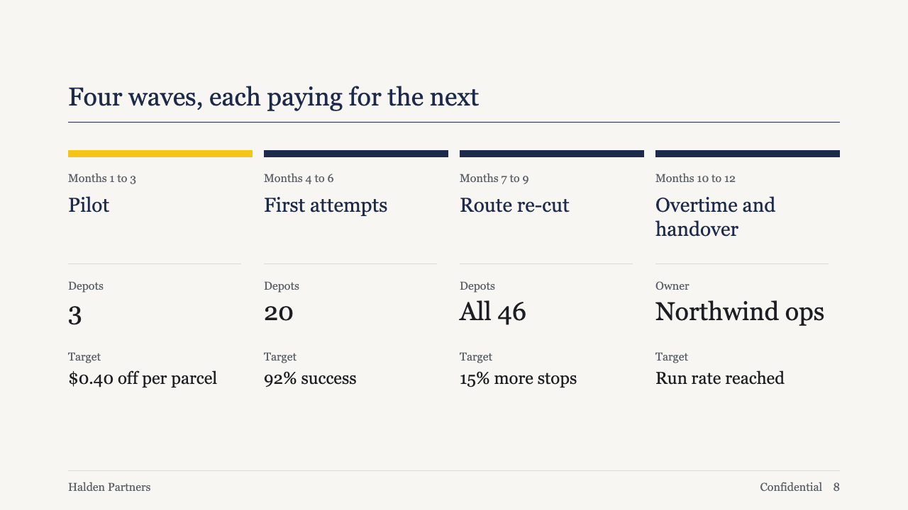
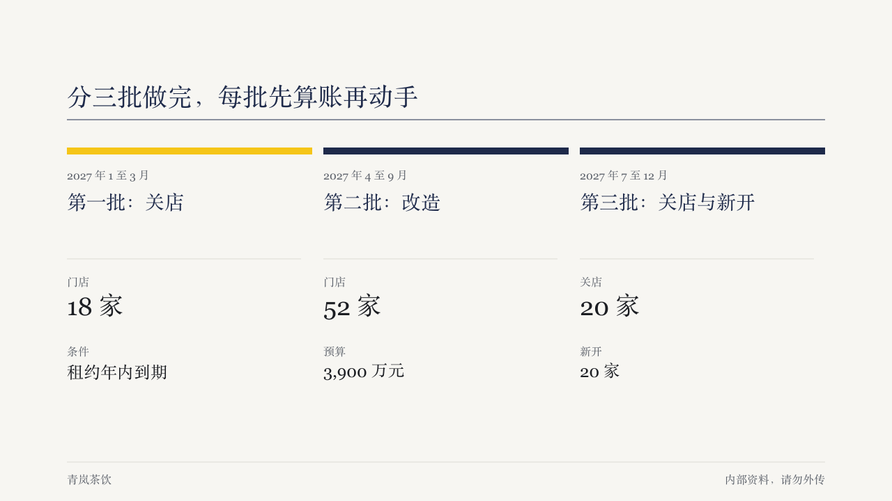

# waves

A roadmap set as open columns, one per phase, each under a colour bar.

Code: [`src/layouts/compositions/waves.tsx`](../../../src/layouts/compositions/waves.tsx). The header comment there is the contract.

## brief, 2026-10

| board (p08) | engine |
| :-: | :-: |
|  |  |

**What it looks like.** Columns share the full width with 16px between them. Each starts with a 10px bar, primary, or accent on the one phase the author marked. Under it: the period small and muted, the phase name at 28px in primary within two lines, a hairline, then up to two measures with small labels, the first set large (36px) and the second at 24px.

**Why.** A plan reads left to right as time, and bars that run edge to edge carry that without arrows. Only the marked phase takes the highlight, so the yellow says "this is where it starts" rather than decorating every phase.

**What it gave up.**

- No cards, numbers or arrows, which the ordinary roadmap component has. The bars and the order are the only sequence marks.
- Two to four phases, at most two measures each. A plan with more goes back to the ordinary roadmap.
- Every column runs to the same fixed depth (382px under the band's top), so the band must be at least that tall.
- All first measures share one size so the row reads level. When one of them is long, all of them step down to 24px together.
