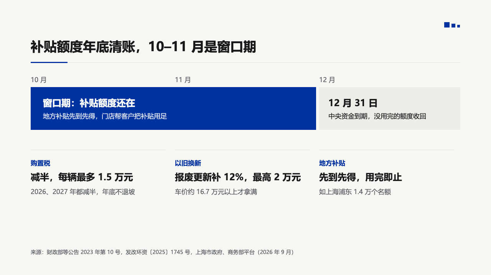

# window

A short calendar set as one band of blocks, the marked stretch in the primary colour, with the facts that make it matter in columns under it.

Code: [`src/layouts/compositions/window.tsx`](../../../src/layouts/compositions/window.tsx). The header comment there is the contract.

## bulletin, NEV sample, 2026-10

Settled on the subsidy page. The round's decisions are in [rounds/2026-10-03-bulletin](../../rounds/2026-10-03-bulletin/README.md).

| board (p10) | engine |
| :-: | :-: |
|  |  |

**What it looks like.** The months are named along the top at 17px muted. Each stretch is a block across its months, 8px apart: its name bold at 24px and its line at 17px under it. The stretch the author marks (`gantt.items[].emphasis`) is a primary block with light text, the others sit on the light panel. Under the band, each fact stands in a column over a hairline: a 17px label in primary, the fact bold at 24px, and a 17px muted note.

**Why.** "October and November are the window, December 31 is the deadline" is a calendar, but a gantt with an axis and bars is more drawing than the two stretches need. Naming the months and filling the window says it at a glance, and the facts under it say why the window matters.

**What it gave up.**

- A `gantt` whose bars never overlap and start and end on whole units, with `axis_labels` naming each unit (two to six), followed by `kpi_cards` of two to four facts.
- A stretch's words must fit its block: one line of name, two of text.
