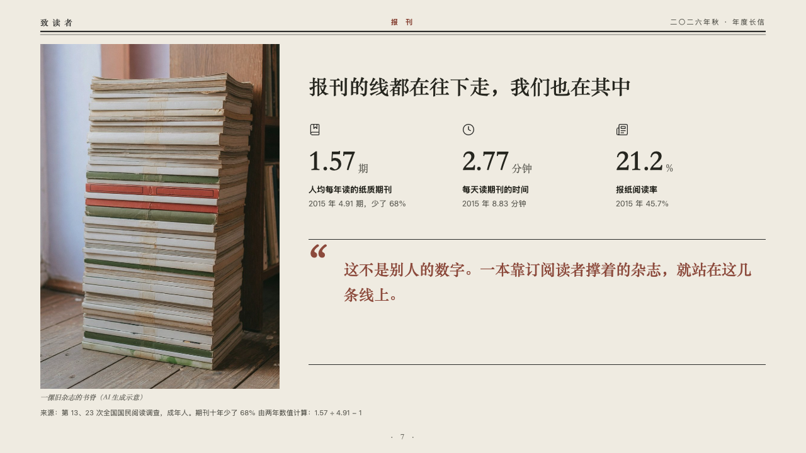
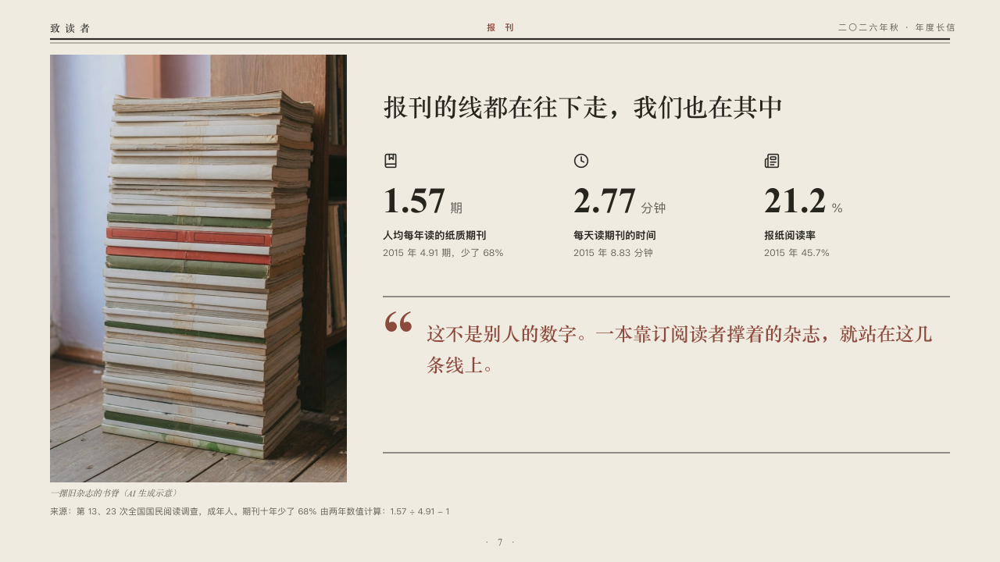

# witness

Figures over a pull quote beside a photograph.

Code: [`src/layouts/compositions/witness.tsx`](../../../src/layouts/compositions/witness.tsx). The header comment there is the contract. The periodical setting only.

## journal, annual letter to readers sample, 2026-10

Settled on p07. The round's decisions are in [2026-10-07-journal](../../rounds/2026-10-07-journal/README.md).

| board (p07) | engine |
| :-: | :-: |
|  |  |

**What it looks like.** A photograph the height of the page at the left, up to the masthead, its plain caption under it, and the claim beside it. Under the claim two or three figures in a row, each its symbol, the figure large in the heading serif with its unit small, its label and the line that puts it in context. Under them the pull quote between two rules of the type's ink, a quotation mark large in brick red at its left and its words in brick red in the heading serif.

**Why.** Three figures about periodicals, then the editors saying these numbers are their own.

**What it gave up.**

- Takes an `image`, a `kpi_cards` of two or three (every one with a symbol or none, no tag, source or direction) and a `blockquote` with no attribution.
- A claim that does not fit beside the photograph, or a figure, label, note, caption or quote past its room, sends the page back.
