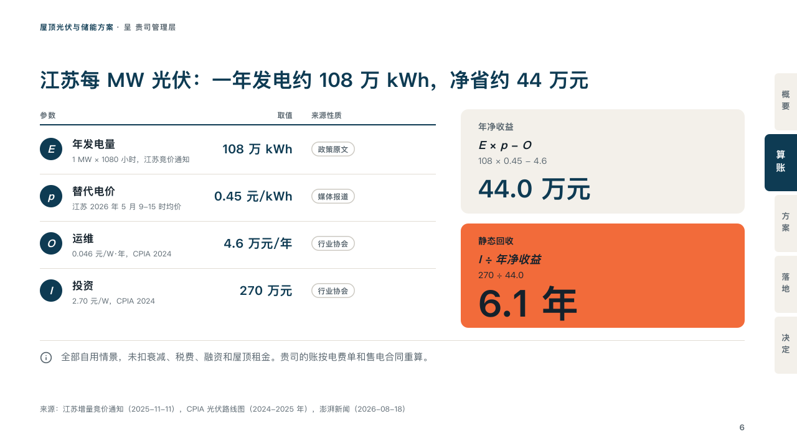

# workings

A sum worked out on one page: its inputs, its working and its answer.

Code: [`src/layouts/compositions/workings.tsx`](../../../src/layouts/compositions/workings.tsx). The header comment there is the contract. The binder setting only.

## proposal, rooftop solar and storage proposal sample, 2026-10

Settled on the per-MW sum page (p06), the page a proposal is judged on. The round's decisions are in [rounds/2026-10-06-proposal](../../rounds/2026-10-06-proposal/README.md).

| board (p06) | engine |
| :-: | :-: |
|  |  |

**What it looks like.** At the left the inputs as a ruled table under a 2px rule of petrol: each input's symbol in a petrol disc (「E」, 「p」, 「O」, 「I」), its name bold over how it is reached in small grey, its value at 20px in petrol to the right, and what kind of source it rests on as an outlined chip. At the right a card with what is worked out, the formula in italic, the figures put in and the result at 40px in petrol, and under it the answer the page lands on as a block of the tangerine, its result at 60px in the text ink. Under both, a line under a hairline saying what the sum leaves out.

**Why.** A finance lead checks a proposal by redoing its sum. Every input with its source and every step of the working on one page lets them do it without asking.

**What it gave up.**

- Takes a `data_table` of four columns (the name, how it is reached with an empty header, the value aligned right, the kind of source) and two to four rows, each name led by a one-letter symbol and a space, a `kpi_cards` of two whose notes are written "formula = figures", the second marked whole, and optionally a `callout` with no title or tag.
- The symbol's space and the " = " are declared on the lines they end, not printed.
- The formula is set in the theme's font in italic. The board set it in Georgia, which the deck does not carry.
- A cell past its column, a formula, figures or result past its card, or a line past one line sends the page back.
