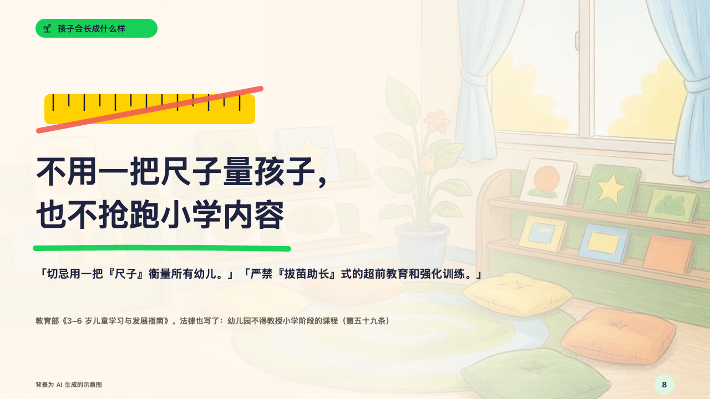
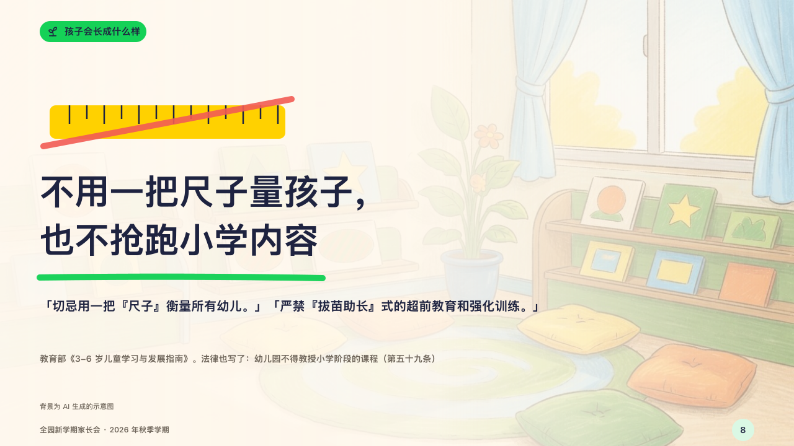

# yardstick

One thing the page refuses to do, said large, with the words it rests on.

Code: [`src/layouts/compositions/yardstick.tsx`](../../../src/layouts/compositions/yardstick.tsx). The header comment there is the contract. The crayonbox setting only.

## crayon, new term parents' meeting sample, 2026-10

Settled on p08. The round's decisions are in [2026-10-08-crayon](../../rounds/2026-10-08-crayon/README.md).

| board (p08) | engine |
| :-: | :-: |
|  |  |

**What it looks like.** A yellow ruler 380 by 54 with its marks, crossed out by a red stroke, at the top left. Under it the claim at 56/78 on two lines at most, hanging from y270, a 456px stroke of the section's crayon under it, the quoted words (20/32, two lines) and where they come from in the grey (14/26). The face lays the page's photograph under it, veiled by the paper from the left.

**Why.** A guideline's warning against measuring every child with one ruler is the page, and the drawing says it before the words do.

**What it gave up.**

- Takes one `blockquote` with an attribution.
- A quote or an attribution past two lines or a claim past two lines send the page back.
