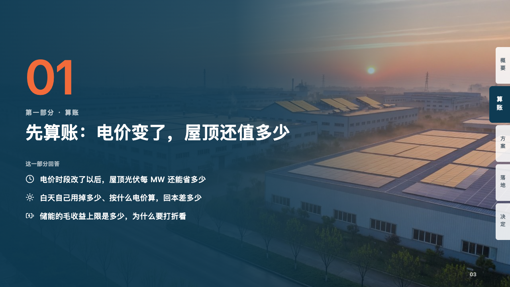

# binder-chapter

proposal's section page: the photograph under petrol, the section's number huge in tangerine, and the questions the section answers.

Code: [`src/layouts/chapter-binder-chapter.tsx`](../../../src/layouts/chapter-binder-chapter.tsx).

## proposal, rooftop solar and storage proposal sample, 2026-10

Settled on p03 and p10. The round's decisions are in [rounds/2026-10-06-proposal](../../rounds/2026-10-06-proposal/README.md).

| board (p03) | engine |
| :-: | :-: |
|  |  |

**What it looks like.** The page's own photograph under a darkening of petrol from the left (96%, 86% at 46%, 25% at 82%, 10% at the right edge), the binder's tabs over it with the section's tab lit and the rest white at 86%. The section's number at 120px bold in the tangerine (「01」, counted by the engine in the order the chapter pages appear), the page's `kicker` under it at 16px in white at 72% (「第一部分 · 算账」), the title at 44/60 bold in white, the subheading at 14px (「这一部分回答」), and the page's `row_cards` as the questions, each a white icon and a line at 19px.

**Why.** A client reads a proposal for answers to their own questions. Opening each section on the questions it answers tells them which pages to read.

**What it gave up.**

- The author writes the section's name, never its number.
- The board printed a page number on the section pages. The engine prints footer marks on content pages only.
- A title on two lines moves what is under it down a line.
