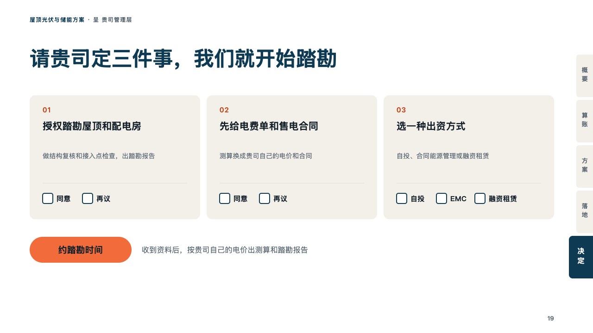
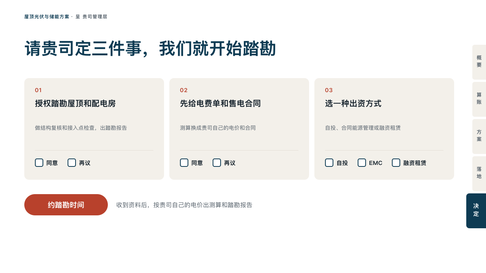

# binder-ending

proposal's close: the decisions the client is asked to make, each a card with its own boxes, and one brick-red button with the author's words.

Code: [`src/layouts/ending-binder-ending.tsx`](../../../src/layouts/ending-binder-ending.tsx).

## proposal, rooftop solar and storage proposal sample, 2026-10

Settled on p19. The round's decisions are in [rounds/2026-10-06-proposal](../../rounds/2026-10-06-proposal/README.md).

| board (p19) | engine |
| :-: | :-: |
|  |  |

**What it looks like.** The deck's label at the top left (the page's `kicker`) and the tabs with the last section lit. The closing line at 44/60 bold in petrol, its last line ending at y156. Under it the page's `numbered_cards` as two to four cards of sand across the measure, each with its number in the brick red (「01」), the decision at 21/32 bold in two lines at most, a line on it in two lines of 14px grey, a hairline, and a box to tick for each choice of the page's `ballot` (「同意」, 「再议」), or the item's own choices where `ballot.item_choices` gives it some (「自投」, 「EMC」, 「融资租赁」). At the foot a button of the brick red with the page's `paragraph` in bold white (「约踏勘时间」), and the subheading beside it at 16px in the grey.

**Why.** A proposal ends on what the client decides. A box per choice makes the decision a mark on the page, and the button is the next step in the author's own words.

**What it gave up.**

- No button without a `paragraph`: the face never writes its own words on it.
- A ballot whose `item_choices` names a card the page does not have, or a signature line, is declared dropped.
- No motif and no folio. The board printed 「19」 at the foot.
