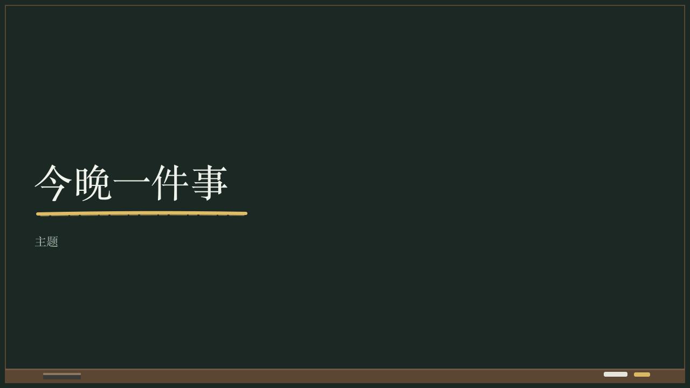

# chalkboard-chapter

The board wiped for the next part of the lesson: its number small, its name large in the serif with one stroke of yellow chalk under it.

Code: [`src/layouts/chapter-chalkboard-chapter.tsx`](../../../src/layouts/chapter-chalkboard-chapter.tsx). Used by lecture.

## lecture, annual tax reconciliation evening class sample, 2026-10

The board drew no chapter page: the sample runs its three parts by the lesson's step at the top left of each page. This face is drawn to the same board from the cover's parts. The round's decisions are in [2026-10-08-lecture](../../rounds/2026-10-08-lecture/README.md).

| engine (gallery) |
| :-: |
|  |

**What it looks like.** The part's number (`kicker`) at 13px in the chalk grey tracked 6px from y64. The name (`heading`) at 72/90 in the serif in chalk white, its last line resting on y380, a twelfth smaller to stay on one line, then down to six tenths and broken at a comma, one stroke of yellow chalk under its last line. A line (`subheading`) at 22/34 in the serif in the grey from y430. The board, the ledge and the count are the motif's.

**Why.** A teacher wipes the board and writes the next part's name before saying a word about it.

**What it gave up.**

- No board settled it. A later round that draws a lecture chapter page settles it.
