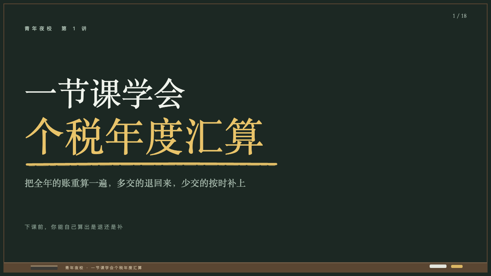
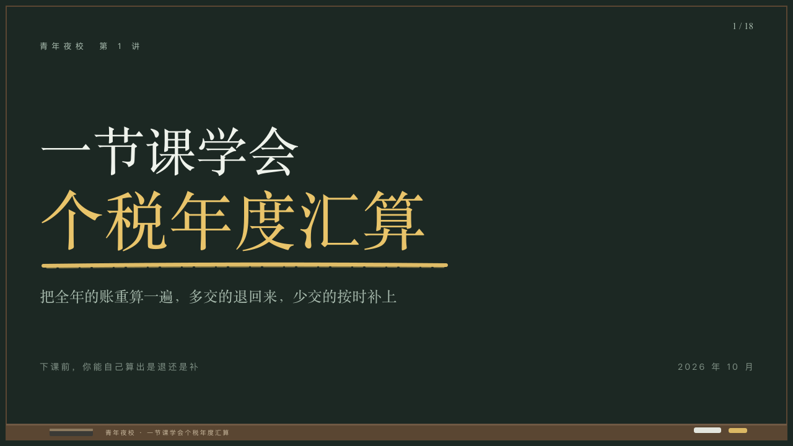

# chalkboard-cover

The board before an evening class begins: the lesson's number small, the subject in the serif with the topic in yellow chalk and one stroke under it, what the class does and what you will be able to do by the end.

Code: [`src/layouts/cover-chalkboard-cover.tsx`](../../../src/layouts/cover-chalkboard-cover.tsx). Used by lecture.

## lecture, annual tax reconciliation evening class sample, 2026-10

Settled on p01. The round's decisions are in [2026-10-08-lecture](../../rounds/2026-10-08-lecture/README.md).

| board (p01) | engine |
| :-: | :-: |
|  |  |

**What it looks like.** The lesson's number (`kicker`) at 13px in the chalk grey tracked 6px from y64. The title in the serif, each part the author broke onto a line of its own: a part written wholly `**…**` at 104/120 in yellow with one stroke of yellow chalk under it, the others at 84/100 in chalk white, the last line resting on y410, each shrunk to the 1100px measure down to six tenths of its size. A run marked inside a part takes its own stroke. The subheading's first part at 24/34 in the serif in the grey from y460, the rest at 14px in the dim tracked 3px on y580, the deck's date at the right of that line. The board, the ledge and 「1 / 18」 are the motif's.

**Why.** The class starts with the subject on the board and the one word to remember chalked under.

**What it gave up.**

- The board draws no date: the date stands at the right of the promise line, small, so the deck's `meta.date` is on the page.
- A page photograph (its first `image` or `background`) runs across the board under a wash of it from the left, which the board did not draw.
