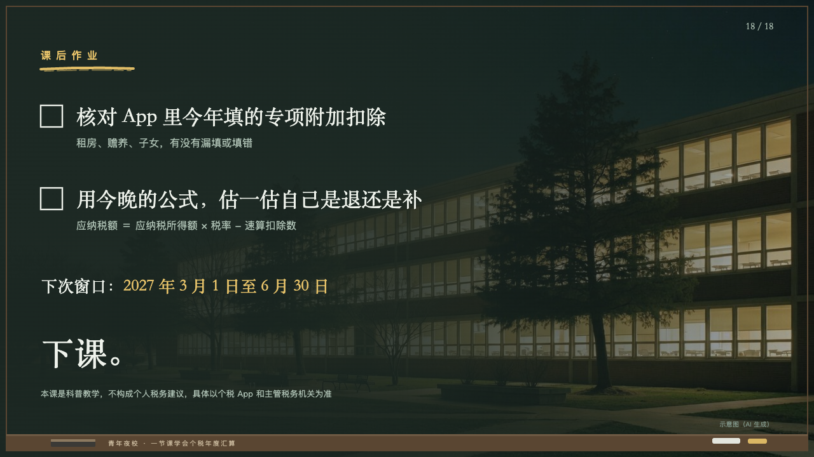
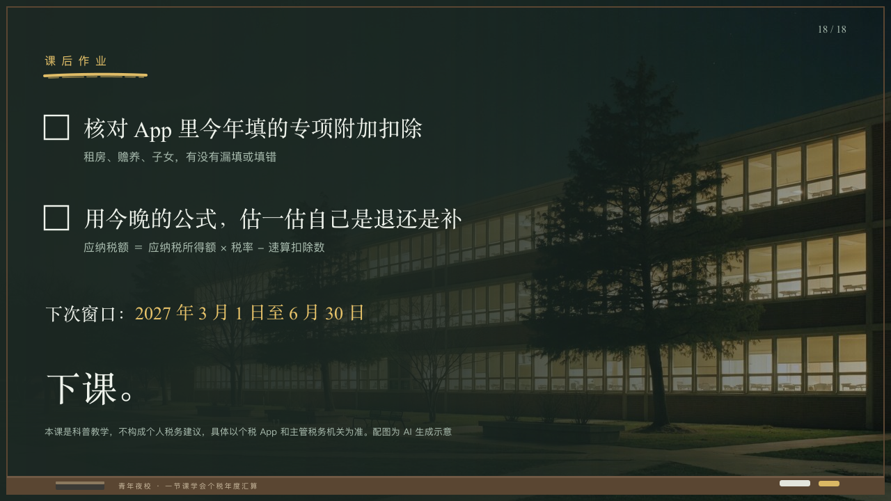

# chalkboard-ending

The end of an evening class: the school lit up at night behind the board, the homework with boxes to tick, the next date in yellow, the dismissal and what the class was not.

Code: [`src/layouts/ending-chalkboard-ending.tsx`](../../../src/layouts/ending-chalkboard-ending.tsx). Used by lecture.

## lecture, annual tax reconciliation evening class sample, 2026-10

Settled on p18. The round's decisions are in [2026-10-08-lecture](../../rounds/2026-10-08-lecture/README.md).

| board (p18) | engine |
| :-: | :-: |
|  |  |

**What it looks like.** The page's photograph across the page under a wash of the board from the left, 97% to 85% at the middle to 30%. The homework's name (`kicker`) at 16px in yellow tracked 8px from y72 with one stroke of yellow chalk under it. One to three tasks from y160 every 130px (a `steps`, or a `bullets` whose items put the task on the first line), each a box of chalk 34px square, the task at 32/46 in the serif in chalk white and how at 16/26 in the grey. The next date (`subheading`) at 26/40 in the serif from y430, its marked words in yellow. The dismissal (`heading`) at 52/70 in the serif from y520. The reminder (`footnote`) at 13/20 in the grey from y610, two lines at most. The board and the ledge are the motif's, over the photograph.

**Why.** The last board of the night: what to do before next time, when it is due, and the class let go.

**What it gave up.**

- The board set the photograph's caption small at the bottom right. The sample says it in the reminder's last sentence instead.
- The tasks are `steps` in the sample: a bullet that holds the task and how to do it passes the bullets' render-safety width.
