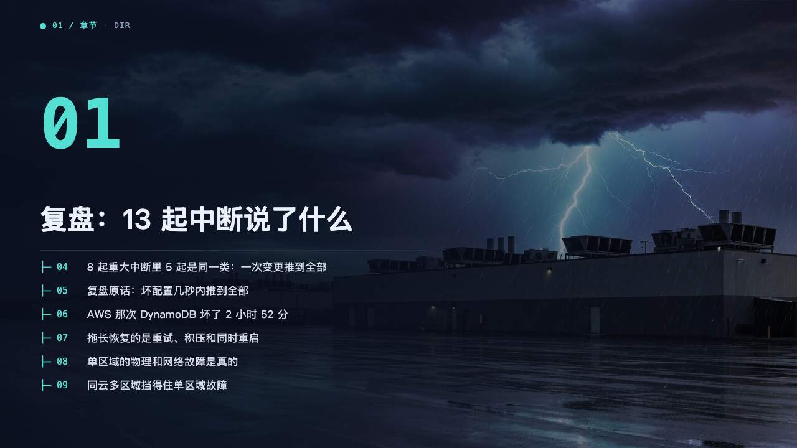
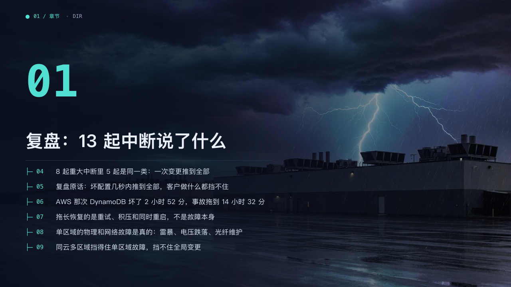

# console-chapter

terminal's chapter page: a full-bleed photograph darkened from the left, the chapter's number large in mono, its title, and its pages listed as a directory.

Code: [`src/layouts/chapter-console-chapter.tsx`](../../../src/layouts/chapter-console-chapter.tsx), the list in [`src/layouts/compositions/contents-console.tsx`](../../../src/layouts/compositions/contents-console.tsx).

## terminal, cloud outage review sample, 2026-10

| board (p03) | engine |
| :-: | :-: |
|  |  |

| board (p10) | engine |
| :-: | :-: |
|  |  |

The round's decisions are in [rounds/2026-10-05-terminal](../../rounds/2026-10-05-terminal/README.md).

**What it looks like.** The photograph darkened as on the cover. The crumb 「● 01 / 章节 · DIR」. The chapter's number, two digits, at 110px bold mono in the mark. The title bold at 44/56, its last line on y369, a subtitle at 18px under it when there is one. A 620px hairline at y402, and under it one row per content page of the chapter, 38px apart: 「├─ 04」 at 15px mono in the mark and the page's heading at 17px in the bright ink, whole.

**Why.** The room sees the section's claims before the evidence. The list is read off the deck, so it never disagrees with the pages.

**What it gave up.**

- The list is drawn whole or not at all, like every contents list.
- The board shortened some headings by hand. The engine prints them as the pages state them, two lines when a heading needs two.
