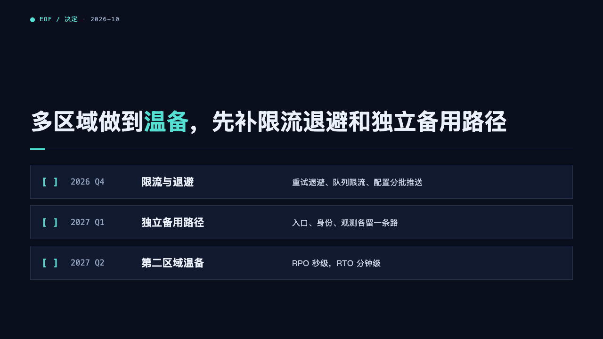
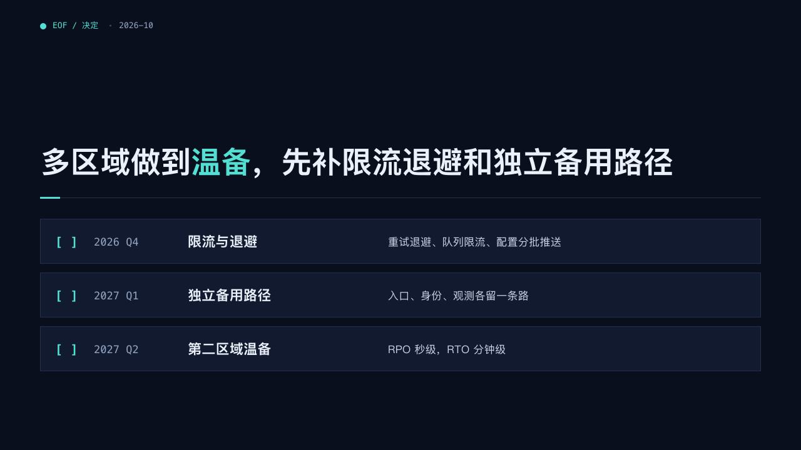

# console-ending

terminal's ending: the decision, and what the team does next as a checklist of boxes still to tick.

Code: [`src/layouts/ending-console-ending.tsx`](../../../src/layouts/ending-console-ending.tsx), the list in [`src/layouts/compositions/checklist.tsx`](../../../src/layouts/compositions/checklist.tsx).

## terminal, cloud outage review sample, 2026-10

| board (p16) | engine |
| :-: | :-: |
|  |  |

The round's decisions are in [rounds/2026-10-05-terminal](../../rounds/2026-10-05-terminal/README.md).

**What it looks like.** The crumb 「● EOF / 决定 · 2026-10」. The decision bold at 48/64, its `**…**` run in the mark, its last line on y276, a hairline under it with a 32 by 3 segment of the mark. Up to four items as cards 72px tall and 86px apart: 「[ ]」 in bold mono in the mark, when it is due in 14px mono, what it is bold at 22px and what it takes at 17px. The items come from the first `timeline` (date, title, description) or the first `bullets`, an item written 「标签：说明」 split at its colon.

**Why.** A review ends on what the room agrees to do and by when. Unticked boxes say the work has not started.

**What it gave up.**

- More than four items are refused at validation. A list that does not fit is not drawn in part.
- The ending draws no photograph.
