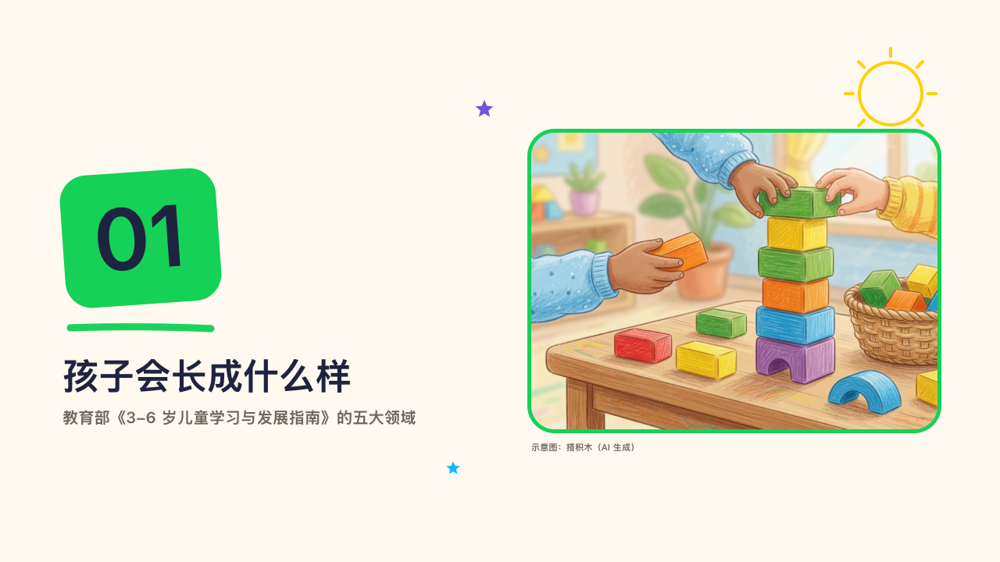

# crayonbox-chapter

crayon's chapter page: a part's number on a tilted block of its section's crayon beside a framed photograph.

Code: [`src/layouts/chapter-crayonbox-chapter.tsx`](../../../src/layouts/chapter-crayonbox-chapter.tsx). Used by crayon.

## crayon, new term parents' meeting sample, 2026-10

Settled on p06 and p10. The round's decisions are in [2026-10-08-crayon](../../rounds/2026-10-08-crayon/README.md).

| board (p06) | engine |
| :-: | :-: |
|  |  |

| board (p10) | engine |
| :-: | :-: |
|  |  |

**What it looks like.** A 200 by 170 block rounded 34, turned -4°, in the crayon of the section the chapter opens (its heading names the section), with the chapter's number at 110px. A stroke of the same crayon under it, the chapter's name at 46/64 and the subtitle (`subheading`) at 20/30 in the grey. At the right the page's photograph 520 by 380 rounded 30 in a 5px frame of the crayon, its note (`footnote`) under it. A sun and two stars.

**Why.** Each part of the meeting opens on its own crayon, so the pages after it are easy to place.

**What it gave up.**

- No page number: the engine prints it on content pages only. The board drew a disc on the chapter pages.
- The photograph's note is new: the board left the chapter's AI photograph unlabelled.
