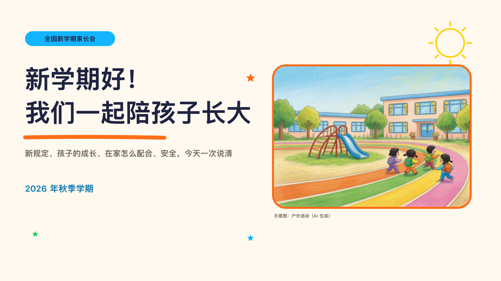

# crayonbox-cover

crayon's cover: a welcome sign drawn on paper beside a framed photograph.

Code: [`src/layouts/cover-crayonbox-cover.tsx`](../../../src/layouts/cover-crayonbox-cover.tsx). Used by crayon.

## crayon, new term parents' meeting sample, 2026-10

Settled on p01. The round's decisions are in [2026-10-08-crayon](../../rounds/2026-10-08-crayon/README.md).

| board (p01) | engine |
| :-: | :-: |
|  |  |

**What it looks like.** A sky capsule at (64, 80), 38px tall and at least 160 wide with the page's `kicker` (or the deck's organization) centred in it. The title at 64/86 in the heavy sans from y160, two lines at most, the author's break kept, a 356px tangerine stroke of crayon 20px under its last line. The subtitle (`subheading`, 20/30 in the grey) and the deck's `meta.date` at 22px in the theme's blue under it. At the right the page's photograph 500 by 360 at (700, 170), rounded 30 in a 5px tangerine frame, its note (`footnote`) under it. A sun at the top right and three stars.

**Why.** A parents' meeting opens like a classroom door decorated for the first day.

**What it gave up.**

- The page is paper: the photograph sits in its frame and is not laid under the page.
- No motif and no footer marks.
