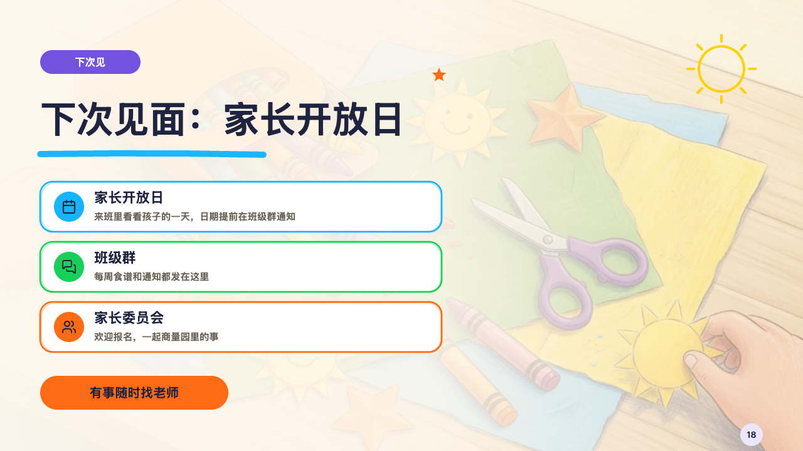

# crayonbox-ending

crayon's close: the next meeting, a contact card a way to reach the school and the line to remember, over a veiled photograph.

Code: [`src/layouts/ending-crayonbox-ending.tsx`](../../../src/layouts/ending-crayonbox-ending.tsx). Used by crayon.

## crayon, new term parents' meeting sample, 2026-10

Settled on p18. The round's decisions are in [2026-10-08-crayon](../../rounds/2026-10-08-crayon/README.md).

| board (p18) | engine |
| :-: | :-: |
|  |  |

**What it looks like.** The page's photograph runs edge to edge under a veil of the paper (97% at the left, 90% at the middle, 40% at the right). A capsule in the deck's last section's crayon with the page's `kicker`. The title at 58/80, a sky stroke of crayon under it. The contact cards: an `icon_cards` (or a `bullets` whose items read 「名字：说明」), 640 by 80, white, outlined twice in a crayon each, a disc of the crayon with the symbol (or the number), the name at 22px and the line at 15px in the grey, three in a column, four to six in two. The page's `subheading` on a tangerine pill at y600, and the `footnote` small at the bottom left.

**Why.** A meeting closes on how to keep talking, not on a summary.

**What it gave up.**

- No page number, as on the chapter pages.
- A set title, a tag or a tone on a card has no place, and the cards are declared dropped. So are cards that would reach the pill.
