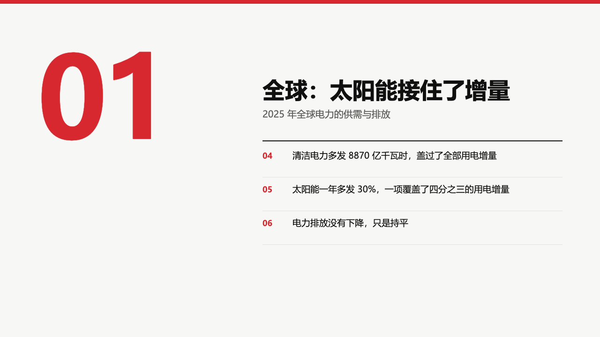
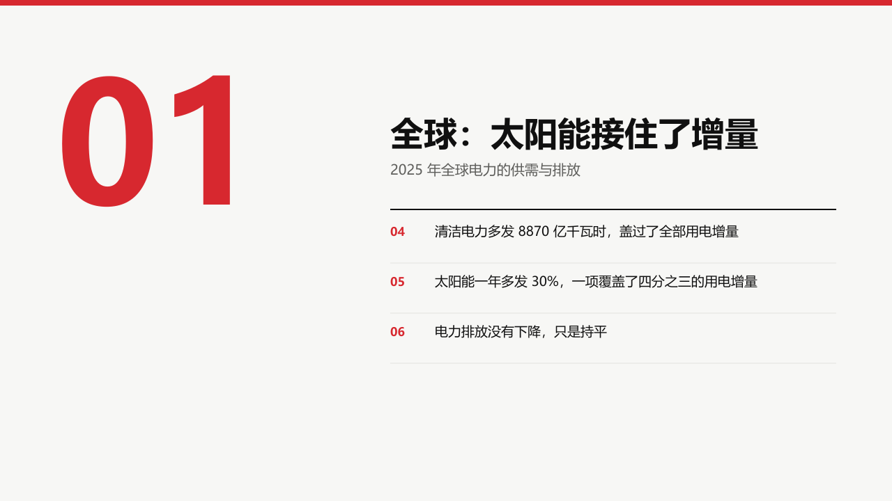

# decimal-index-chapter

A report's chapter page that doubles as the chapter's contents: the number large in the accent on the left, the name and what it covers on a heavy rule on the right, and under the rule the pages the chapter holds.

Code: [`src/layouts/chapter-decimal-index-chapter.tsx`](../../../src/layouts/chapter-decimal-index-chapter.tsx), the list by [`contents`](../../compositions/contents/). Used by swiss.

## swiss, power sample, 2026-10

The round's decisions are in [rounds/2026-10-03-swiss](../../rounds/2026-10-03-swiss/README.md).

| board (p03) | engine |
| :-: | :-: |
|  |  |

**What it looks like.** The chapter number, two digits, 240px bold in the theme's emphasis ink from x80, y72. From x560 in a 640px column: the name at 48/58 bold set on its last line (box ending at y220), the subheading at 20/30 muted from y228, a 2px black rule at y300. Under the rule, one row per content page from this chapter page to the next: the page number in 17px bold in the accent, the page's heading at 19/28 in at most two lines, a hairline under each row, rows 72px apart.

**Why.** A report reader turns to a page by its number. Listing the chapter's pages on its divider saves a contents page and tells the room what is coming.

**What it gave up.**

- The `1.0` decimal numeral and the measuring rule of the August board.
- The list is read off the deck, so the author writes nothing for it, and it is drawn whole or not at all: a chapter with more pages than the band holds (four at 72px, six at 52px when every heading is one line) or a heading past two lines leaves the chapter page without its list.
- A numeral this large reads as a recessed ghost unless it says otherwise, so it carries `data-depth="fg"` and keeps its full colour.
