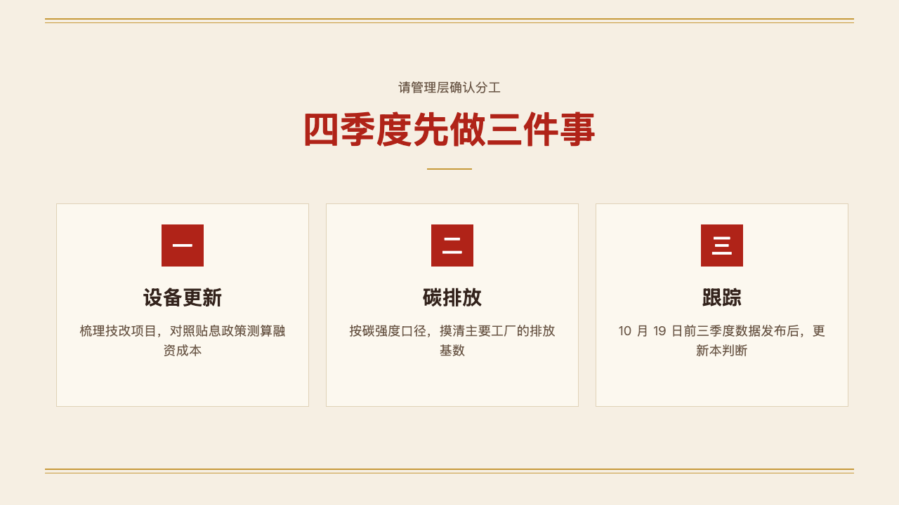
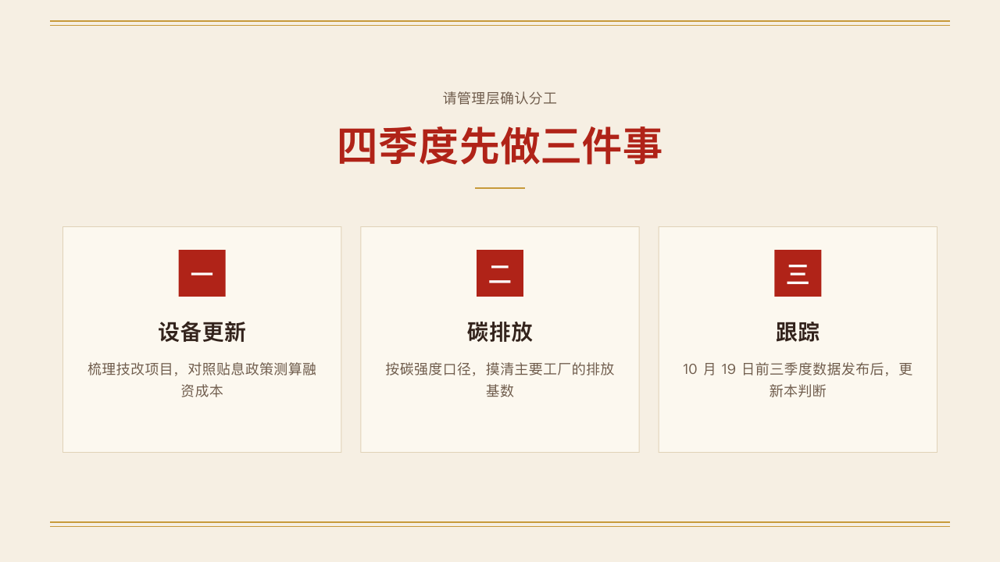

# deliberation-ending

The formal close: what the page asks of the room, the decision, and the steps it means as numbered cards.

Code: [`src/layouts/ending-deliberation-ending.tsx`](../../../src/layouts/ending-deliberation-ending.tsx). Used by vermilion.

## vermilion, government work report sample, 2026-10

The round's decisions are in [rounds/2026-10-04-vermilion](../../rounds/2026-10-04-vermilion/README.md).

| board (p15) | engine |
| :-: | :-: |
|  |  |

**What it looks like.** The `subheading` centred at 18/30 in the quiet ink, its line ending at y140. The `heading` centred, bold, at 52/70 in the primary colour, ending at y220. A 64 by 2 bar in the accent at y240. Under it, two to four cards from y290, 290px tall with 24px between: the panel with a hairline edge, a 60px numbered square in the deck's numerals, the label at 28/40 bold and the gloss at 18/28 in the quiet ink. An item written 「标签：说明」 splits at the colon, and the label declares the colon (`data-gloss-break`). An item with no label is the label when it fits one line and the card's sentence when it does not. The gold rules at the head and the foot are the theme's motif.

**Why.** A briefing to management ends by asking for a decision on a few named steps. The ask, the decision and the steps read top to bottom, each step numbered as the rest of the deck numbers.

**What it gave up.**

- The old face set a short heading as a letter-spaced kicker and printed ARRANGEMENTS when there was nothing to list. The decision is now the largest words on the page, and the face prints nothing it was not given.
- Four steps at most. More, or a gloss past three lines, declines the cards and declares the drop.
