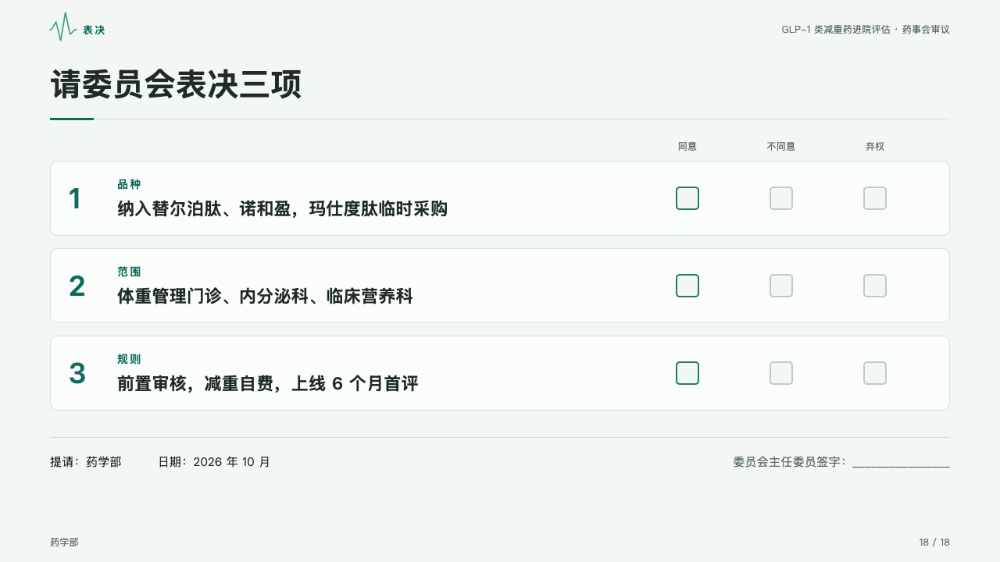
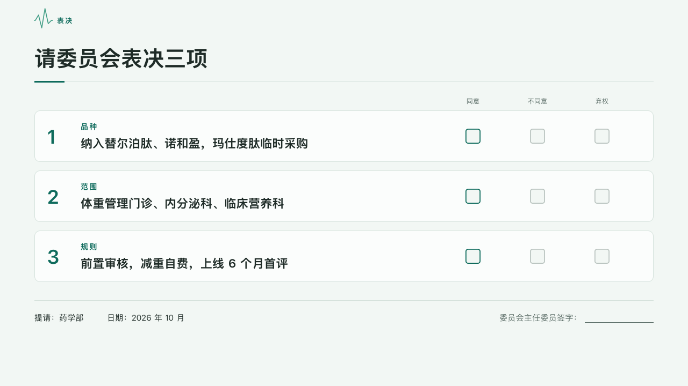

# dossier-ending

clinic's ballot: the items a committee votes on, one card each with its number and kind, a box per choice, who submits it and when, and a line to sign.

Code: [`src/layouts/ending-dossier-ending.tsx`](../../../src/layouts/ending-dossier-ending.tsx). Used by clinic.

## clinic, GLP-1 formulary review sample, 2026-10

Settled on p18, with the page's `ballot`. The round's decisions are in [rounds/2026-10-05-clinic](../../rounds/2026-10-05-clinic/README.md).

| board (p18) | engine |
| :-: | :-: |
|  |  |

**What it looks like.** The section beside the motif's heartbeat. The question bold at 40/56 from y80, over a hairline at y152 with a 56 by 3 bar of the mark. A subheading, when there is one, in 16px muted type under the rule. With a `ballot`, its choices (「同意」「不同意」「弃权」) in 12px muted type over a column each at the right. The first `bullets`, up to four, one card each, 112px apart at most: its number bold at 36px in the mark, its kind (an item written 「类别：事项」) bold at 14px in the mark with its characters 2px apart, the item bold at 22px, and a box to tick per choice, the first outlined in the mark and the rest in grey. Under a hairline at y560 the page's `fields` on one line (「提请：药学部」「日期：2026 年 10 月」) and at the right the ballot's `signature` with a line to sign.

**Why.** A file closes on what is to be decided, put to the vote item by item, and on who answers for it.

**What it gave up.**

- Four items at most. Without a ballot the cards have no boxes, and without fields or a signature the foot is empty.
- No subject and no folio, as on every theme's ending.
