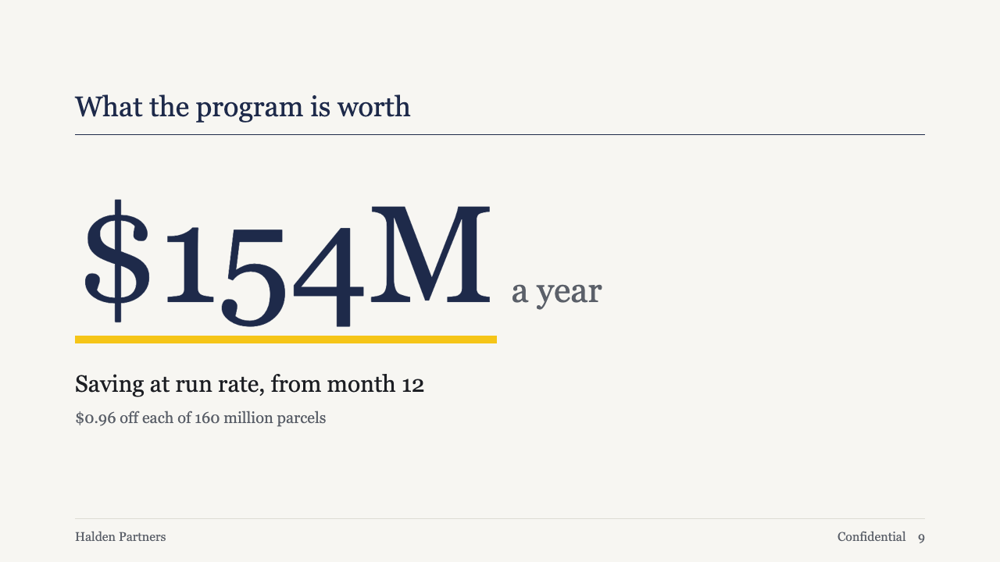
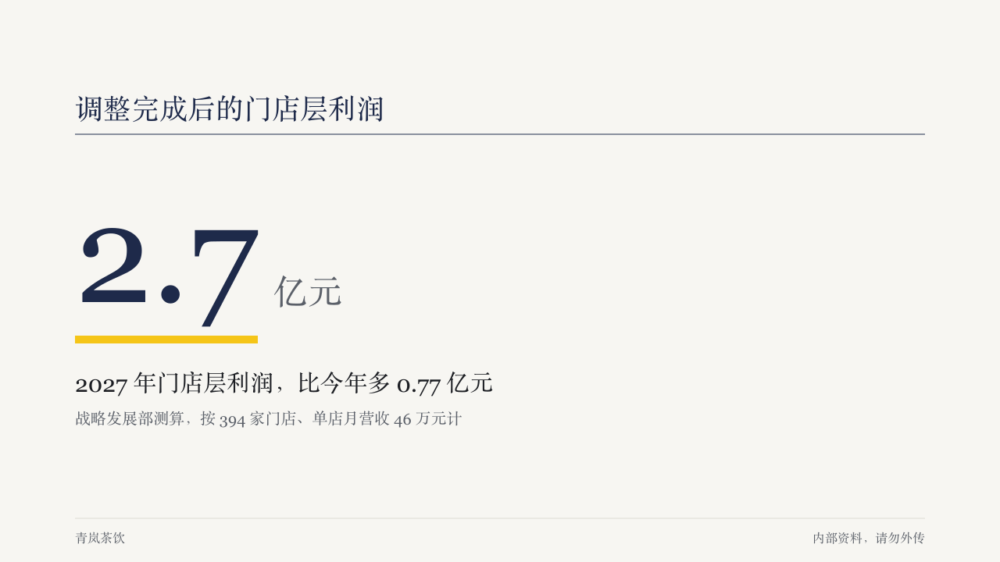

# gauge-figure

brief's fact page: one figure set very large, with what it counts and where it comes from.

Code: [`src/layouts/content-gauge-figure.tsx`](../../../src/layouts/content-gauge-figure.tsx).

## brief, 2026-10

| board (p09) | engine |
| :-: | :-: |
|  |  |

**What it looks like.** The usual heading band, then the figure at 176px regular in primary with its unit at a quarter of that size in muted after it. A 10px yellow bar exactly as wide as the figure runs under it. The caption at 30px within two lines, and the figure's own source at 20px muted.

**Why.** The number a decision rests on should be the largest thing in the deck, and the bar under it is the page's one highlight.

**What it gave up.**

- One `kpi_cards` item with a value and no delta arrow or icon, which the page has no place for. Anything else is drawn as an ordinary sheet page in the same frame.
