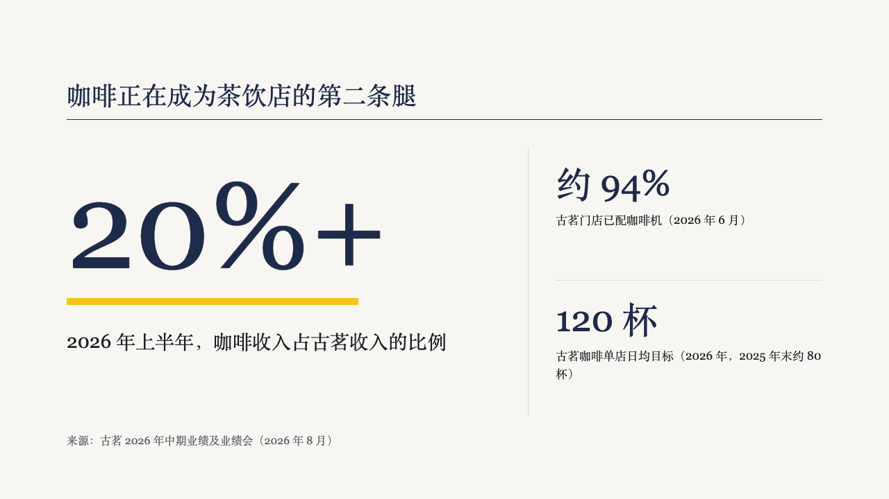
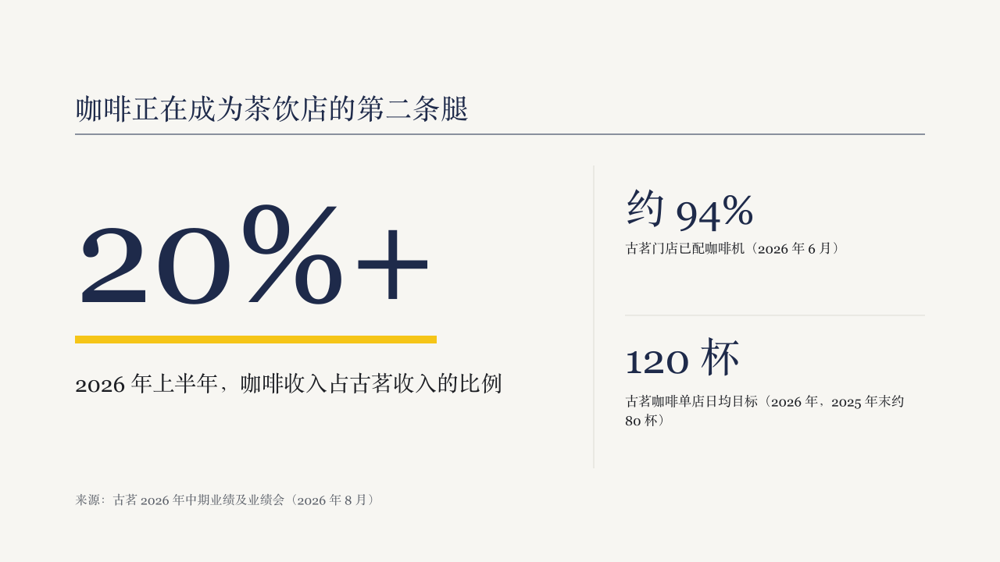

# gauge-figure

brief's fact page: one figure set very large, with what it counts and where it comes from.

Code: [`src/layouts/content-gauge-figure.tsx`](../../../src/layouts/content-gauge-figure.tsx).

## brief, 2026-10

| board (p09) | engine |
| :-: | :-: |
|  |  |

**What it looks like.** The usual heading band, then the figure at 176px regular in primary with its unit at a quarter of that size in muted after it. A 10px yellow bar exactly as wide as the figure runs under it. The caption at 30px within two lines, and the figure's own source at 20px muted.

**Why.** The number a decision rests on should be the largest thing in the deck, and the bar under it is the page's one highlight.

**What it gave up.**

- One `kpi_cards` item with a value and no delta arrow or icon, which the page has no place for. Anything else is drawn as an ordinary sheet page in the same frame.

## brief, tea sample, 2026-10

| board (p10) | engine |
| :-: | :-: |
|  |  |

**What changed.** The kpi_cards' second and third items stand beside the lead figure, right of a hairline at x760 that runs from 12px into the band to 12px above its foot. Each is a figure at 52px in primary from x800 and the line that says what it counts at 17px in body ink within two lines, 196px apart with a hairline between them. With figures beside it, the lead figure's caption steps down to 28px on a 580px measure. The lead figure itself does not move.

**Why.** "Coffee is over 20% of revenue" is the claim, and the two numbers that make it believable, how many stores have the machine and the target per store, belong on the same page without competing with it.

**What it gave up.**

- A supporting figure is a value and its label. A note, a delta arrow, an icon or a source line on one of them, or a note on the lead, sends the page to the sheet, which draws all the figures as an open row.
- The bar under the lead figure stays exactly as wide as the figure. The board drew it 420px wide.
