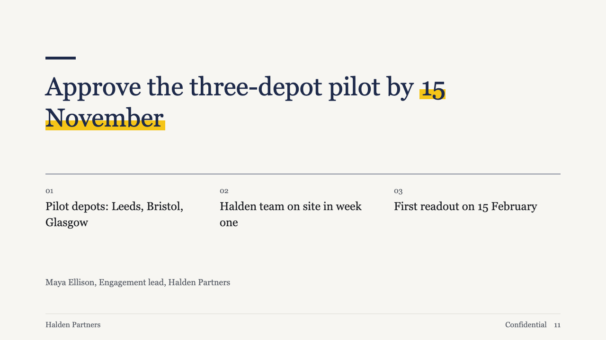
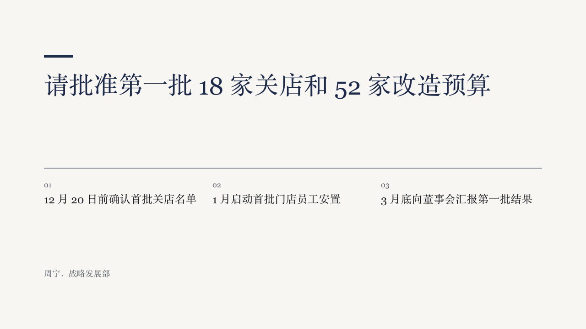

# gauge-next

brief's ending: the closing ask, up to three next steps, and a sign-off.

Code: [`src/layouts/ending-gauge-next.tsx`](../../../src/layouts/ending-gauge-next.tsx).

## brief, 2026-10

| board (p11) | engine |
| :-: | :-: |
|  |  |

**What it looks like.** A short primary bar at y120 over the ask at 54/66 regular weight, with a marked phrase on the highlight. A primary rule at y368 opens three numbered steps at 24/34 within two lines. The author's sign-off at 18px muted at y584.

**Why.** The last page of a proposal asks for one decision and says what happens next. The ask is the point of the page, so it is always drawn whole.

**What it gave up.**

- At most three steps, each within two lines.
