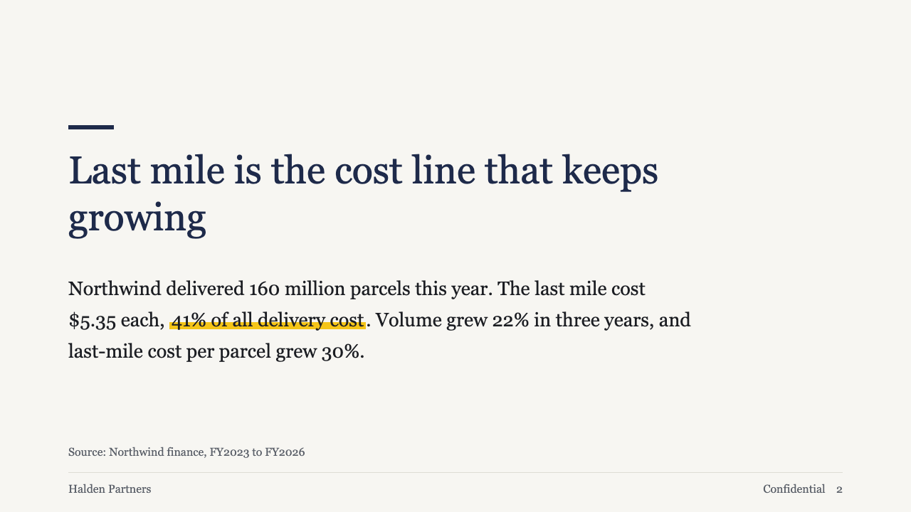

# gauge-point

brief's statement page: one claim, one paragraph of support, the source.

Code: [`src/layouts/content-gauge-point.tsx`](../../../src/layouts/content-gauge-point.tsx).

## brief, 2026-10

| board (p02) | engine |
| :-: | :-: |
|  |  |

**What it looks like.** A short primary bar (64 by 6) over the claim at 54/66 regular weight. The paragraph at 27/44 on an 880px measure, at most four lines, hung a fixed distance under the claim's last line. A marked phrase takes the highlight. The source sits on the footnote line.

**Why.** A statement page carries one sentence the room should remember. The bar is primary, not yellow, so the only yellow on the page is whatever the author marked.

**What it gave up.**

- One body block. Several blocks or a chart belong on a sheet page.
