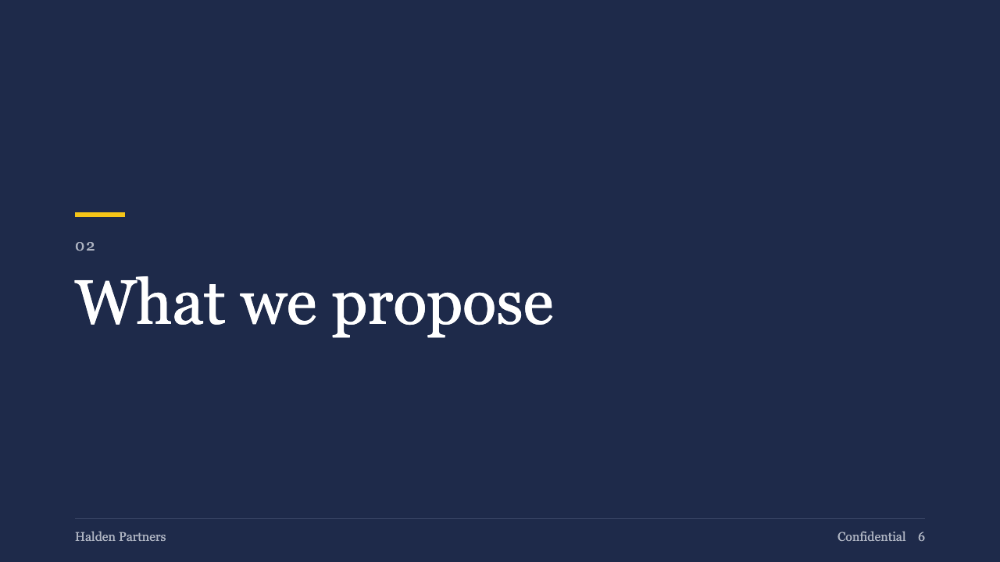

# gauge-section

brief's chapter page: a full navy field, a two-digit ordinal and the chapter title.

Code: [`src/layouts/chapter-gauge-section.tsx`](../../../src/layouts/chapter-gauge-section.tsx).

## brief, 2026-10

| board (p06) | engine |
| :-: | :-: |
|  |  |

**What it looks like.** The page filled with primary. A 64 by 6 yellow bar at y272, the ordinal at 20px with 2px tracking in a quiet grey, then the title at 80/96 regular weight in white. The footer is the motif's dark variant.

**Why.** Chapter pages are the only full-colour pages in the deck, so the pause between sections is unmistakable. Nothing else on the page competes with the title.

**What it gave up.**

- The ordinal comes from the engine's chapter count, so the sample prints "01" where the board printed "02".
