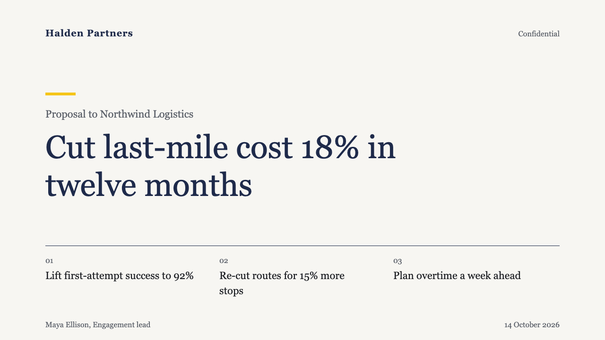
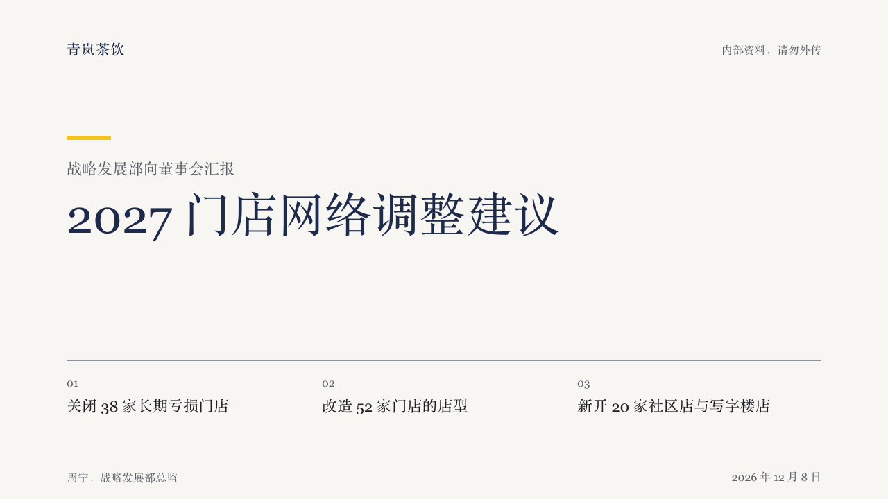

# gauge-verdict

brief's cover: the verdict and its three supporting points on one page.

Code: [`src/layouts/cover-gauge-verdict.tsx`](../../../src/layouts/cover-gauge-verdict.tsx).

## brief, 2026-10

| board (p01) | engine |
| :-: | :-: |
|  |  |

**What it looks like.** The organization top left at 20px bold in primary, the confidentiality label top right at 16px. A 64 by 6 yellow bar over a 22px muted subtitle, then the title at 68/80 regular weight on a 940px measure. A primary rule at y520 opens three columns, each a numbered point at 22/32 within two lines. The first author and role at the foot left, the date at the foot right.

**Why.** A report that leads with its conclusion should put the verdict and its evidence where a board member sees both at once. The yellow bar is the cover's one highlight, so the eye starts at the subtitle and the title under it.

**What it gave up.**

- At most three points, each within two lines. More belongs on a content page.
