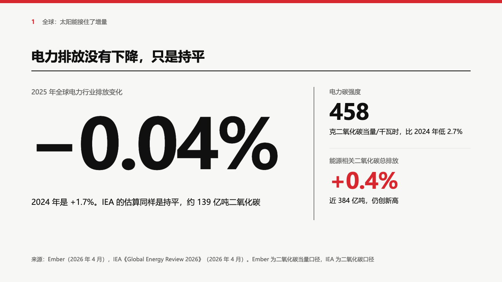
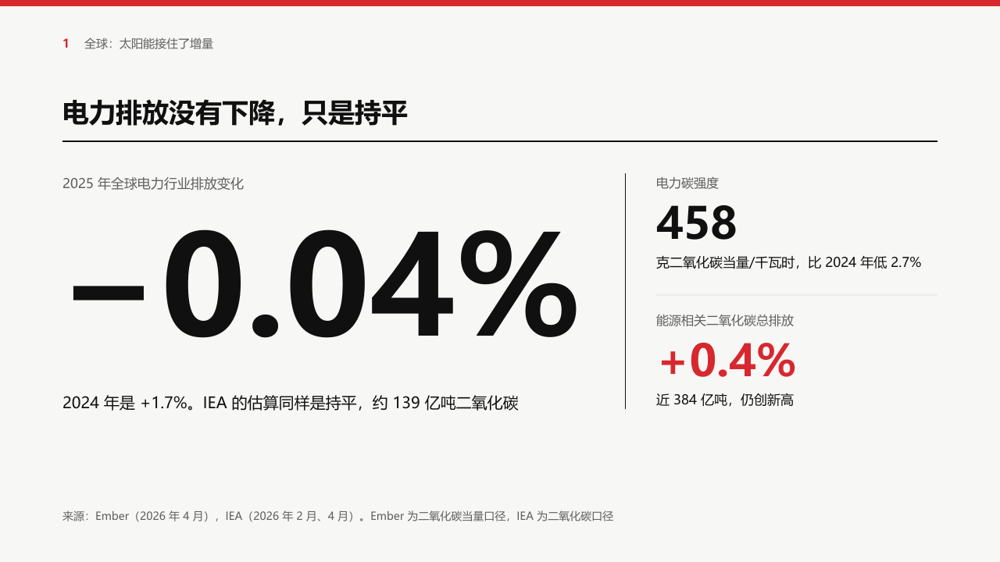

# grid-figure

swiss's single-figure page: under the grid header, one figure very large with the sentence that puts it in context, and up to two supporting figures right of a black rule.

Code: [`src/layouts/content-grid-figure.tsx`](../../../src/layouts/content-grid-figure.tsx). Used by swiss.

## swiss, power sample, 2026-10

The round's decisions are in [rounds/2026-10-03-swiss](../../rounds/2026-10-03-swiss/README.md).

| board (p06) | engine |
| :-: | :-: |
|  |  |

**What it looks like.** The page is a `kpi_cards` of one to three items. The first: a 17px muted label at y222, the figure bold at 176px from x72 (8px into the margin, so its ink lines up with the type area), its note at 20/30 under it in up to two lines of 640px. The second and third stand right of a 1px black rule at x800, 176px apart from y222: a 16px muted label, the figure at 56px, the note at 17/26. A hairline separates them. The figure written `**…**` is in the accent.

**Why.** It is gauge-figure's arrangement (the brief tea board) set in swiss's grid: one number the finding rests on, and the two that qualify it.

**What it gave up.**

- A lead figure too wide for its 688px column steps down to 152, 128 or 104px, all of it together, rather than running under the rule.
- A page of any other shape, a subheading, or text that does not fit is drawn as a grid sheet.
- The board tracks the lead figure by −6px. The engine does not, so the figure is about 30px wider than the board's.
