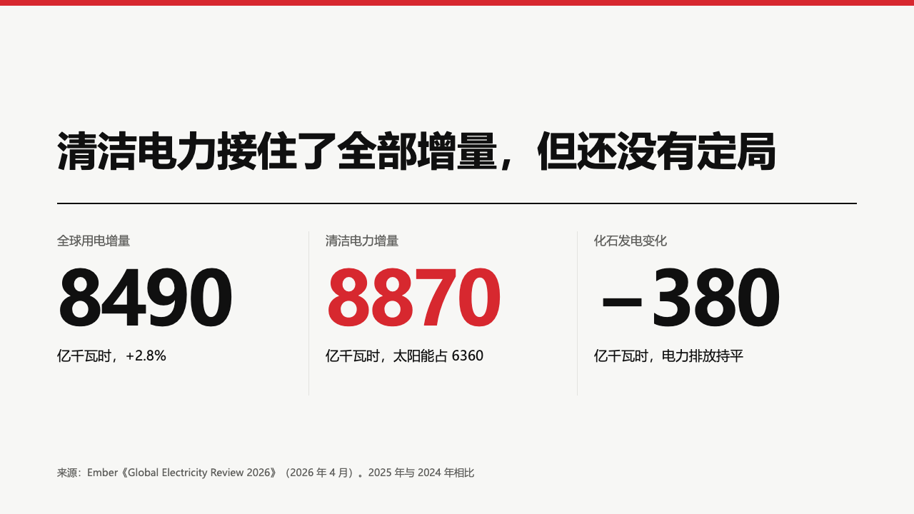

# grid-statement

swiss's statement page: the deck's conclusion large and black over a heavy rule, the figures it rests on in columns under it.

Code: [`src/layouts/content-grid-statement.tsx`](../../../src/layouts/content-grid-statement.tsx), the figures by [`figures`](../../compositions/figures/) in the grid setting. Used by swiss.

## swiss, power sample, 2026-10

The round's decisions are in [rounds/2026-10-03-swiss](../../rounds/2026-10-03-swiss/README.md).

| board (p02) | engine |
| :-: | :-: |
|  |  |

**What it looks like.** No chapter line. The conclusion is 56/70 bold across 1120px, at most two lines, set on its last line at y231. A 2px black rule at y284. From y324, two to four figures in columns 376px apart: a 17px muted label, the figure bold at the largest of 104, 72, 56 and 46px at which every figure fits its column, and a 19px note, with hairlines between columns. The figure written `**…**` is in the accent. The source sits at the foot in 14px.

**Why.** The statement is the one sentence a reader should be able to quote, and the three numbers are its proof, so they stand together on one page.

**What it gave up.**

- The shared `statement` face squeezed a page's paragraph and source into one 18px line and cut a long one. This face draws a paragraph, or any body that is not a row of figures, with the component renderer under the rule at its own size, and steps aside when that band cannot hold it.
- A subheading becomes a 20px muted line under the rule, over the figures.
- The board tracks the figures by −3px. The engine does not.
