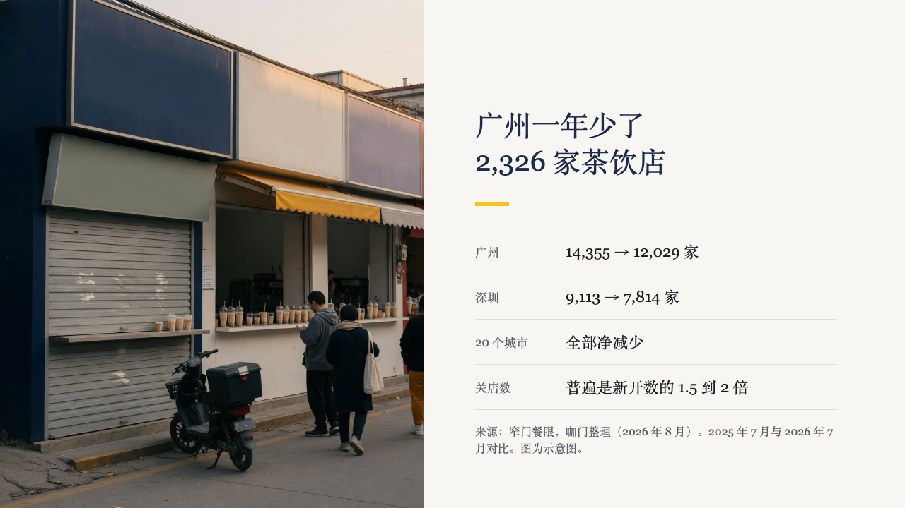
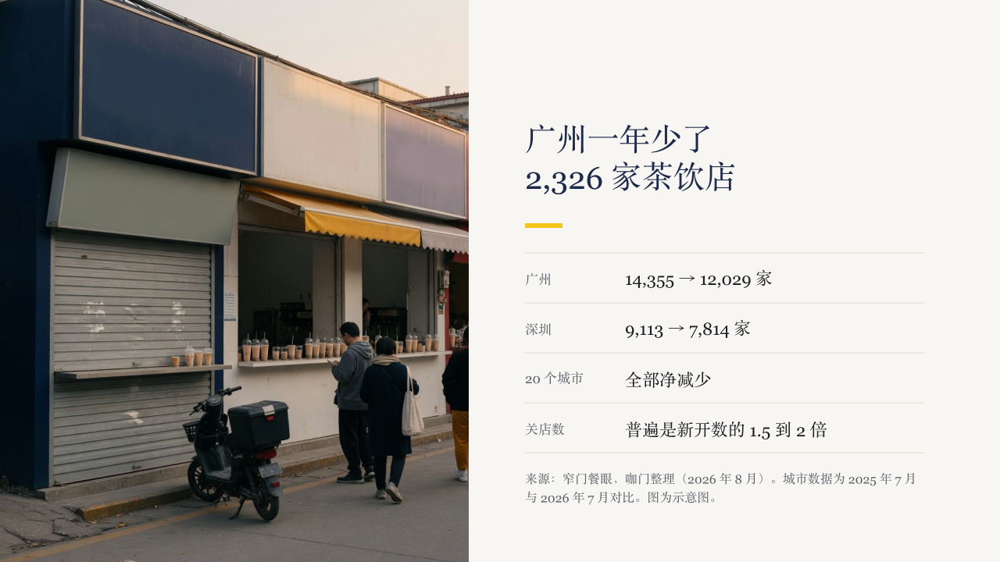
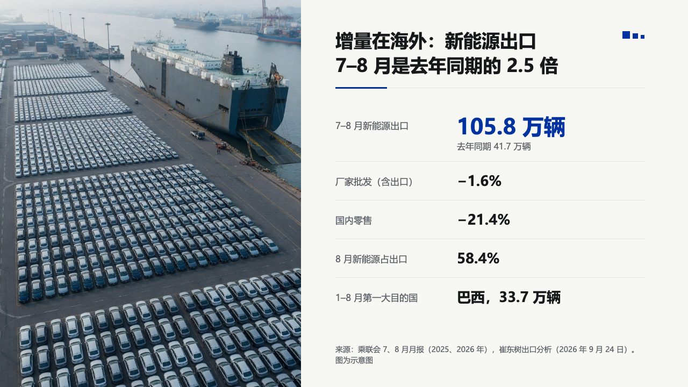
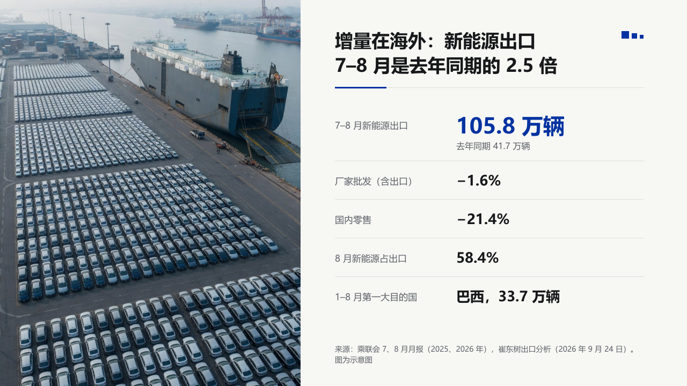
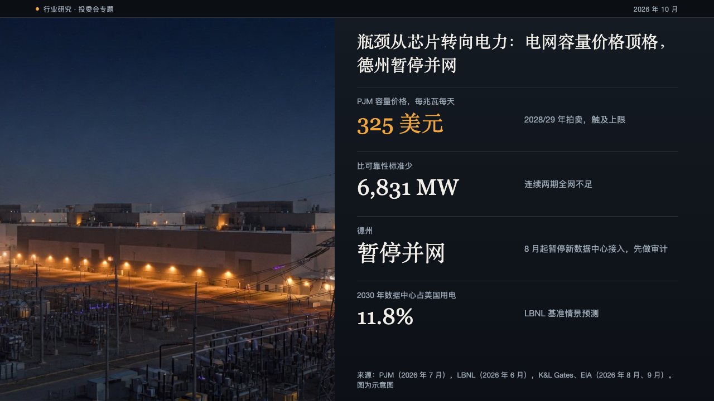
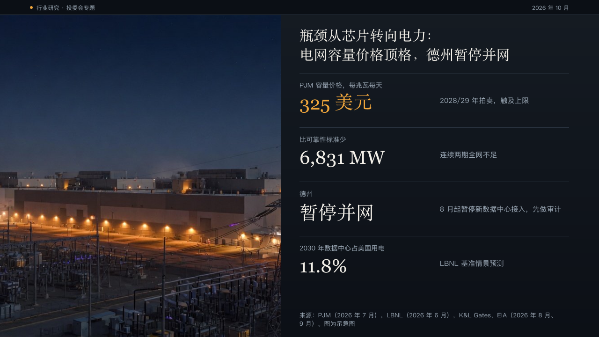

# image-split

The side takeover: a photograph bleeding full height down one side of the page, the heading, a short accent bar and the page's other blocks in a column beside it.

Code: [`src/render/image-pages.tsx`](../../../src/render/image-pages.tsx) (`ImageSplitPage`, `SPLIT_COLUMNS`). Shared by bulletin, ink, journal, luxe, museum and brief.

## brief, tea sample, 2026-10

| board (p04) | engine |
| :-: | :-: |
|  |  |

**What it looks like.** brief's menu asks for the face's `report` column (`params: { column: "report" }`). The photograph is 600px wide. The column starts at x672: the title at 40/52 regular weight in primary, a 48 by 6 accent bar 32px under it, and a list of "Label: value" facts set as ruled pairs by the shared [`pairs`](../../compositions/pairs/) composition. The source line sits at the foot of the column, up to two 16px muted lines ending on y642.

**Why.** A report sets a photograph beside the facts it stands for. The regular title and the short heavy bar are brief's voice on every page, and the pairs read as a ledger next to the picture.

**What it gave up.**

- The `standard` column, which every other theme keeps, is unchanged: a 540px photograph, a 44px semibold title, a 72 by 4 bar and the components stacked under it.
- A list the pairs cannot set whole is stacked under the bar the ordinary way.

**The source line, on every theme.** The four takeovers (`image-split`, `image-top`, `image-bottom`, `image-annotate`) drew no `footnote` at all before this round, so a photo credit or a data source on a photo page reached nobody, and nothing said so. Each now sets it at 16px in muted ink within two lines: at the foot of the text column here, on the footnote line across the page under `image-top` and `image-annotate`, and centred between the text and the picture under `image-bottom`. `pptwise audit` reports a source line a page never paints.

## bulletin, NEV sample, 2026-10

bulletin's menu asks for the `notice` column. The round's decisions are in [rounds/2026-10-03-bulletin](../../rounds/2026-10-03-bulletin/README.md).

| board (p05) | engine |
| :-: | :-: |
|  |  |

**What it looks like.** The photograph fills x0 to x560 full height. The column starts at x624: the notice head (the 34px black bold claim, bottom-aligned, over the hairline and its 96 by 3 IKB bar) in 520px, the facts as notice [`pairs`](../../compositions/pairs/) from y196, and the 14px source at the column's foot.

**Why.** The photo page is one more notice: the same head as every content page, so the deck reads as one document, with the photograph standing in for the chart.

**What it gave up.**

- A list the pairs cannot set is stacked under the head the ordinary way.

## ledger, AI capex sample, 2026-10

ledger's menu asks for the `panel` column (`params: { column: "panel" }`), and ledger offers photo pages for the first time. The round's decisions are in [rounds/2026-10-04-ledger](../../rounds/2026-10-04-ledger/README.md).

| board (p12) | engine |
| :-: | :-: |
|  |  |

**What it looks like.** The photograph takes the left 600px under the status bar, edge to edge from y32 to the foot. Beside it from x640, the claim in the heading face at 30/42, set on its last line at y136. Under it, when the column is one `kpi_cards`, a ledger of two to five rows 116px apart over hairlines: the label at 14px muted, the figure at 40px in the heading face (amber when marked) and the note at 15px, 300px into the row. Anything else in the column is drawn by the component renderer. The source sits at the column's foot at 13px, and a caption the author gave the photograph sits right above it in the same 13px.

**Why.** The power page is the one place the deck shows the physical thing the money buys. A clean photograph beside a short ledger of the grid's numbers keeps the screen's grammar without putting a panel over the picture.

**What it gave up.**

- The photograph carries nothing: no caption strip, no scrim. A caption moves into the column.
- A page that is not one photograph and what this column holds is drawn as a panel sheet under the same frame.

## vermilion, government work report sample, 2026-10

vermilion's menu asks for the `seal` column (`params: { column: "seal" }`), and vermilion offers photo pages for the first time. The round's decisions are in [rounds/2026-10-04-vermilion](../../rounds/2026-10-04-vermilion/README.md).

| board (p13) | engine |
| :-: | :-: |
|  |  |

**What it looks like.** The photograph takes the left 560px edge to edge, full height. Beside it the column draws the theme's gold double rule from x600 to x1216 (the menu turns the motif off on this page), the claim bold in the primary colour at 32/44 from x616, set on its last line at y146, and a 64 by 2 accent bar at y160. Under it, when the column is one `kpi_cards`, up to four rows 128px apart over hairlines: the label at 15px, the figure bold at 42px (in the mark when marked) and the note at 16px 324px into the row. Anything else in the column is drawn by the component renderer. The source sits at the column's foot at 14px, and a caption sits right above it. A page that asks for the photograph on the right (`image_side: "right"`) is mirrored: the photograph from x720, the rule from x64 to x680, the column from x80.

**Why.** The equipment page is the one place the deck shows the thing the money buys. The column keeps the head every page wears, so the photo page still reads as part of the document.

**What it gave up.**

- No subheading: a page with one is drawn as a seal sheet.
