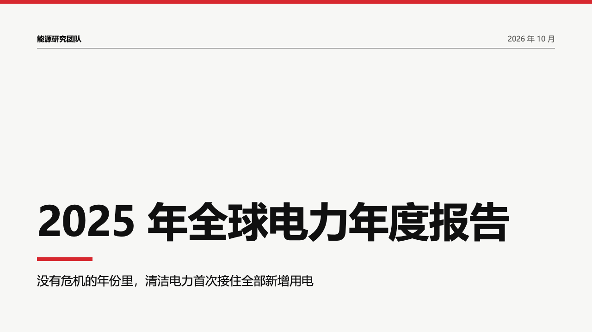
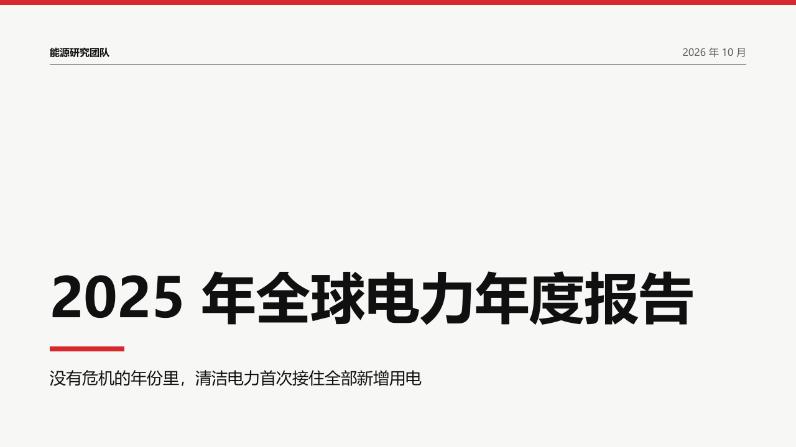

# institutional-block

An institutional report's cover: the organization and the date over a black hairline, the title large and bold on the lower half, a short bar in the accent, the subtitle.

Code: [`src/layouts/cover-institutional-block.tsx`](../../../src/layouts/cover-institutional-block.tsx). Used by swiss.

## swiss, power sample, 2026-10

The round's decisions are in [rounds/2026-10-03-swiss](../../rounds/2026-10-03-swiss/README.md).

| board (p01) | engine |
| :-: | :-: |
|  |  |

**What it looks like.** One 16px line at the top: `meta.organization` bold on the left, the date (and a confidentiality mark, when the deck's footer puts one on the cover) muted on the right, over a 1px black rule from x80 to x1200 at y104. The title is 88/106 bold across the full 1120px, at most two lines, set on its last line so the last line's box ends at y530 and a second line grows upward. A 120 by 8 bar in the accent at y558, the subtitle at 26/36 under it from y590.

**Why.** An annual report's cover names who is speaking and when, then lets the title sit low and heavy on white. The red belongs to the edge and one short bar, never to a band of colour behind text.

**What it gave up.**

- The 172px title on the left, the tracked kicker, the 150 by 14 signature block and the two-line byline of the August board.
- The date prints only when the deck asks for its document meta (`branding: "full"`), the rule every cover keeps. The sample sets `branding: "full"` with an empty `footer`, as bulletin's does.
- No letter spacing: the export does not carry it.
